---
## Front matter
lang: ru-RU
title: Лабораторная работа №1
subtitle: Установка ОС Linux
author:
  - Жибицкая Евгения Дмитриевна
institute:
  - Российский университет дружбы народов, Москва, Россия
## i18n babel
babel-lang: russian
babel-otherlangs: english

## Formatting pdf
toc: false
toc-title: Содержание
slide_level: 2
aspectratio: 169
section-titles: true
theme: metropolis
header-includes:
 - \metroset{progressbar=frametitle,sectionpage=progressbar,numbering=fraction}
 - '\makeatletter'
 - '\beamer@ignorenonframefalse'
 - '\makeatother'
 
## Fonts
mainfont: PT Serif
romanfont: PT Serif
sansfont: PT Sans
monofont: PT Mono
mainfontoptions: Ligatures=TeX
romanfontoptions: Ligatures=TeX
sansfontoptions: Ligatures=TeX,Scale=MatchLowercase
monofontoptions: Scale=MatchLowercase,Scale=0.9
---

# Цель

## Цель
Приобритение навыков по установке операционной системы и сервисов, необходимых для работы с ней.

# Выполнение лабораторной работы

## Создание виртуальной машины
:::::::::::::: {.columns align=center}
::: {.column width="50%"}

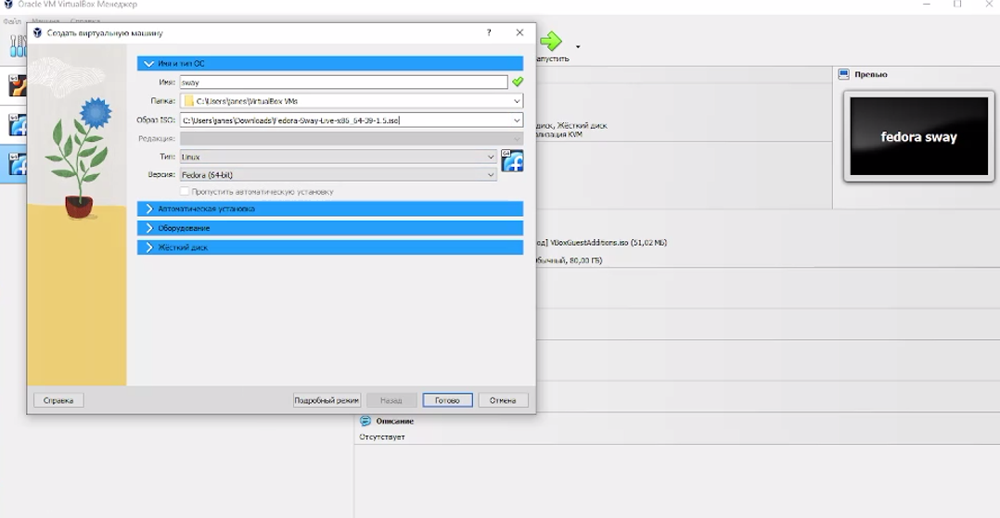
:::
::::::::::::::
## Запуск и установка системы
:::::::::::::: {.columns align=center}
::: {.column width="50%"}

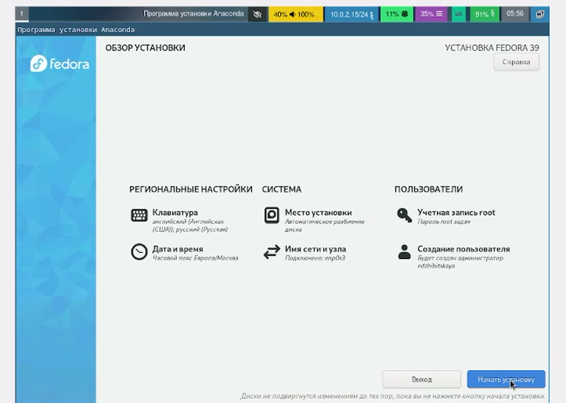
:::
::::::::::::::

## Подключение автообновлений, установка tmux
:::::::::::::: {.columns align=center}
::: {.column width="50%"}

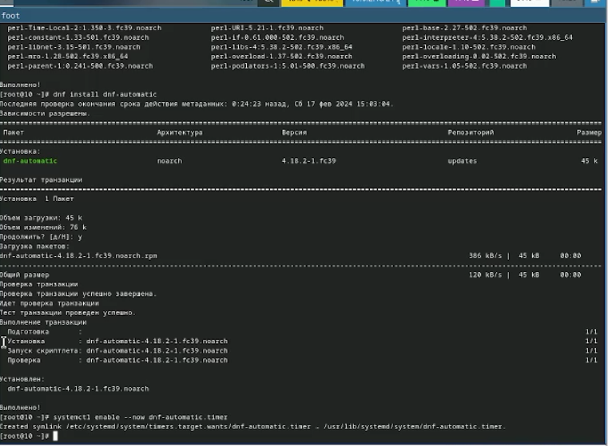
:::
::::::::::::::

## Отключение SeLinux 
:::::::::::::: {.columns align=center}
::: {.column width="50%"}

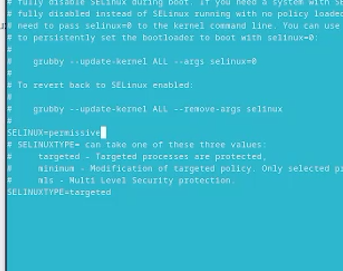
:::
::::::::::::::

## Установка драйвера
:::::::::::::: {.columns align=center}
::: {.column width="50%"}

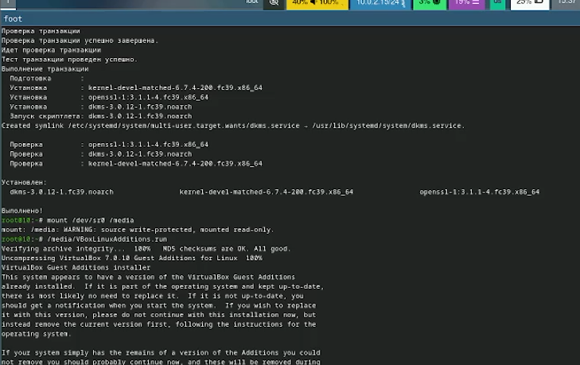
:::
::::::::::::::

## Изменение раскладки клавиатуры 
:::::::::::::: {.columns align=center}
::: {.column width="50%"}

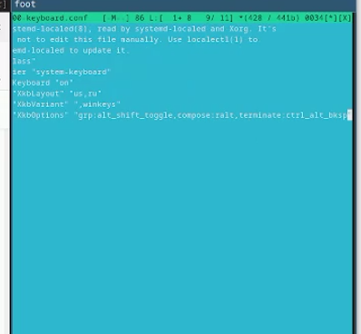
:::
::::::::::::::

## Изменение имени хоста
:::::::::::::: {.columns align=center}
::: {.column width="45%"}

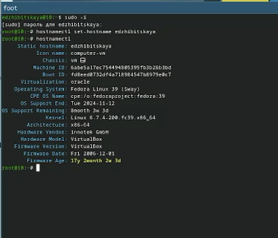
:::
::::::::::::::

## Общая папка

:::::::::::::: {.columns align=center}
::: {.column width="50%"}

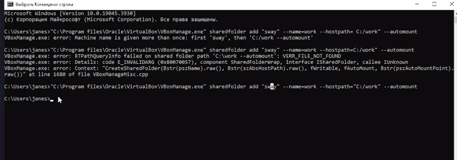
:::
::::::::::::::

## Установка Markdown и Texlive 
:::::::::::::: {.columns align=center}
::: {.column width="45%"}
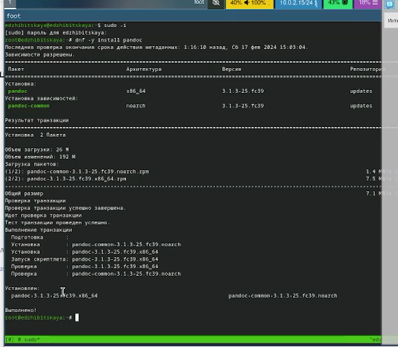
:::
::: {.column width="45%"}
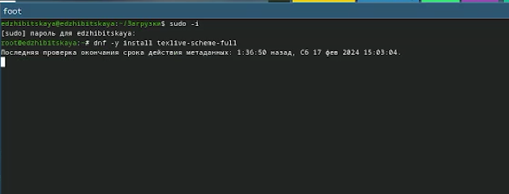
:::
::::::::::::::

#  Домашнее задание 
## Выполнение домашнего задания 
В качестве домашнего задания нам было необходимо получить следующую информацию(с помощью команды dmesg и поиска grep):

- Версия ядра Linux (Linux version) 6.7.4.200
- Частота процессора (Detected Mhz processor). 2295.686
- Модель процессора (CPU0).AND Athlon Silver 0X18
- Объём доступной оперативной памяти (Memory available). 3087396k
- Тип обнаруженного гипервизора (Hypervisor detected). KVM
- Тип файловой системы корневого раздела. BTRSF
- Последовательность монтирования файловых систем. (sda2 - EXT$-fs, sda3 - BTRSF)

## Выполнение домашнего задания 

:::::::::::::: {.columns align=center}
::: {.column width="50%"}

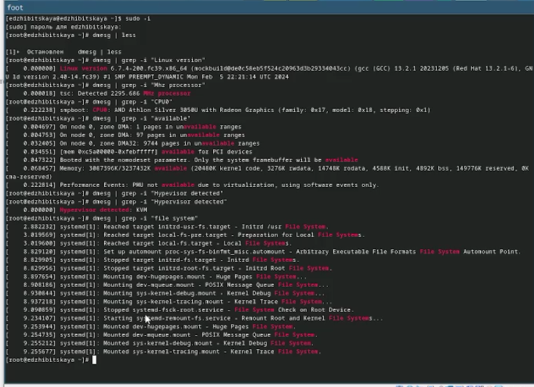
:::
::::::::::::::
 
## Ответы на контрольные вопросы 
1. Какую информацию содержит учётная запись пользователя?
 Первые буквы имени и отчества,  а также фамилию
 
## Ответы на контрольные вопросы  
2. Укажите команды терминала и приведите примеры:
- для получения справки по команде - man
- для перемещения по файловой системе - cd
- для определения объёма каталога - du
- для создания / удаления каталогов / файлов touch/mkdir/ rm
- для задания определённых прав на файл / каталог - chmod
-для просмотра истории команд  - history
        
## Ответы на контрольные вопросы 
3. Что такое файловая система? Приведите примеры с краткой характеристикой.
 - это способ организации и зранения файлов и каталогов на диске/ устройстве.
 
 EXT2-4 - наиболее стабильная в связи с редкими изменениями кодовой базы
 JFS - хороша при необходимости высокой стабильности и минимальном потрелении ресурсов
 XFS - расчитана на файлы больших размеров, имеет незначитльеный размер служебной информации
 
## Ответы на контрольные вопросы 
4. Как посмотреть, какие файловые системы подмонтированы в ОС? 

С помощью команды mount(без аргументов)

## Ответы на контрольные вопросы 
5. Как удалить зависший процесс? 

Использовать команду kill

# Вывод

## Вывод
В ходе работы была установлена fedora sway на виртуальную машину, были приобретены навыки по ее установке и  работе с ней.

