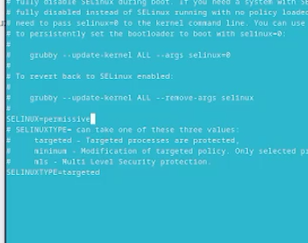

---
## Front matter
title: "Лабораторная работа №1"
subtitle: "Дисциплина: Операционные системы"
author: "Жибицкая Евгения Дмитриевна"

## Generic otions
lang: ru-RU
toc-title: "Содержание"

## Bibliography
bibliography: bib/cite.bib
csl: pandoc/csl/gost-r-7-0-5-2008-numeric.csl

## Pdf output format
toc: true # Table of contents
toc-depth: 2
lof: true # List of figures
lot: true # List of tables
fontsize: 12pt
linestretch: 1.5
papersize: a4
documentclass: scrreprt
## I18n polyglossia
polyglossia-lang:
  name: russian
  options:
	- spelling=modern
	- babelshorthands=true
polyglossia-otherlangs:
  name: english
## I18n babel
babel-lang: russian
babel-otherlangs: english
## Fonts
mainfont: PT Serif
romanfont: PT Serif
sansfont: PT Sans
monofont: PT Mono
mainfontoptions: Ligatures=TeX
romanfontoptions: Ligatures=TeX
sansfontoptions: Ligatures=TeX,Scale=MatchLowercase
monofontoptions: Scale=MatchLowercase,Scale=0.9
## Biblatex
biblatex: true
biblio-style: "gost-numeric"
biblatexoptions:
  - parentracker=true
  - backend=biber
  - hyperref=auto
  - language=auto
  - autolang=other*
  - citestyle=gost-numeric
## Pandoc-crossref LaTeX customization
figureTitle: "Рис."
tableTitle: "Таблица"
listingTitle: "Листинг"
lofTitle: "Список иллюстраций"
lotTitle: "Список таблиц"
lolTitle: "Листинги"
## Misc options
indent: true
header-includes:
  - \usepackage{indentfirst}
  - \usepackage{float} # keep figures where there are in the text
  - \floatplacement{figure}{H} # keep figures where there are in the text
---

# Цель работы

Приобритение навыков по установке операционной системы и сервисов, необходимых для работы с ней.

# Выполнение лабораторной работы
Виртуальная машина Virtual box был установлен ранее, поэтому первое, что мы делаем это создаем машину на основе fedora sway  и задаем базовые настройки(выделяем память,загрузочный vdi, ускорение, подключаем оптический диск, iso и т.д.) (рис. [-@fig:001]).

{#fig:001 width=70%}

Затем запускаем виртуальную машину, устанавливаем операционную систему. Выбираем язык, устанавливаем имя пользователя, пароль для root и себя, задаем сетевое имя (рис. [-@fig:002]).

{#fig:002 width=70%}

После входа в систему запускаем все обновления и включаем автообновление(рис. [-@fig:003]). Также загружаем tmux.

{#fig:003 width=70%}

Кроме того отключаем SELinux (рис. [-@fig:004]).

{#fig:004 width=70%}

Затем установим драйвера, установив средства разработки, dkms и подмонтировав диск (рис. [-@fig:005]).

{#fig:005 width=70%}

Изменим раскладку клавиатуры, отредактировав нужные файлы (рис. [-@fig:006]).

{#fig:006 width=70%}

При установке имя пользователя было указано верно, а имя хоста нет( не соответствует соглашению об именовании), поэтому изменим его (рис. [-@fig:007]).

{#fig:007 width=70%}

Также необходимо подключить общую папку(вместе с хостовой машиной) (рис. [-@fig:008]).

{#fig:008 width=70%}

Последнее, что надо сделать, это установить markdown и texlive(рис. [-@fig:009]),(рис. [-@fig:010]). Кроме того Pandoc crossref устанавливался через github и разархивироапние файла.

{#fig:009 width=70%}

{#fig:010 width=70%}

# Домашнее задание
В качестве домашнего задания нам необходимо получить следующую информацию:

    Версия ядра Linux (Linux version) 6.7.4.200
    Частота процессора (Detected Mhz processor). 2295.686
    Модель процессора (CPU0).AND Athlon Silver 0X18
    Объём доступной оперативной памяти (Memory available). 3087396k
    Тип обнаруженного гипервизора (Hypervisor detected). KVM
    Тип файловой системы корневого раздела. BTRSF
    Последовательность монтирования файловых систем. (sda2 - EXT$-fs, sda3 - BTRSF)
    
{#fig:011 width=70%}
    
Ответы на конторльные вопросы 

1. Какую информацию содержит учётная запись пользователя?
Первые буквы имени и отчества,  а также фамилию
 
2. Укажите команды терминала и приведите примеры:
        для получения справки по команде - man
        для перемещения по файловой системе - cd
        для определения объёма каталога - du
        для создания / удаления каталогов / файлов touch/mkdir/ rm
        для задания определённых прав на файл / каталог - chmod
        для просмотра истории команд  - history

3. Что такое файловая система? Приведите примеры с краткой характеристикой.
 - это способ организации и зранения файлов и каталогов на диске/ устройстве.
 
 EXT2-4 - наиболее стабильная в связи с редкими изменениями кодовой базы
 JFS - хороша при необходимости высокой стабильности и минимальном потрелении ресурсов
 XFS - расчитана на файлы больших размеров, имеет незначитльеный размер служебной информации
 
4. Как посмотреть, какие файловые системы подмонтированы в ОС? 
С помощью команды mount(без аргументов)

5. Как удалить зависший процесс? Использовать команду kill

# Выводы

В ходе работы была установлена fedora sway на виртуальную машину, были приобретены навыки по ее установке и  работе с ней.

