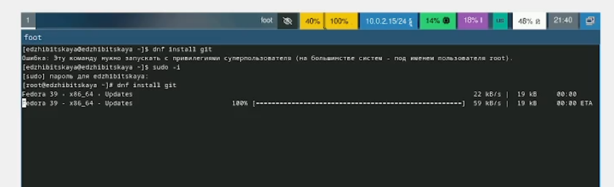
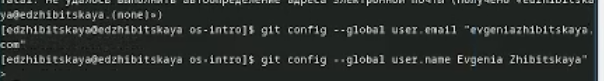
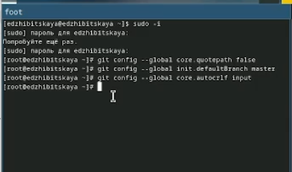
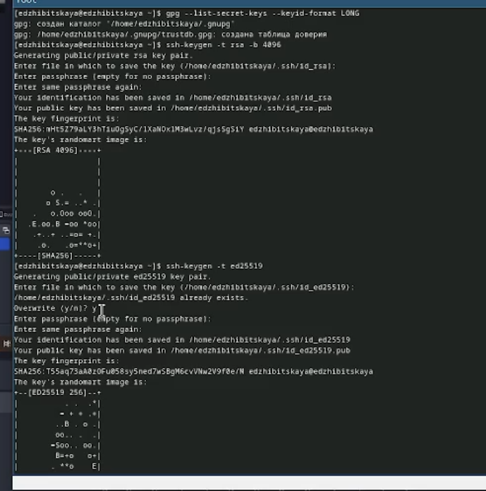
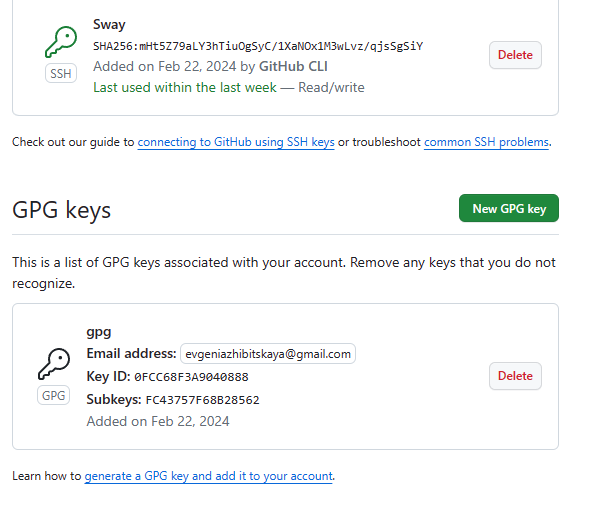
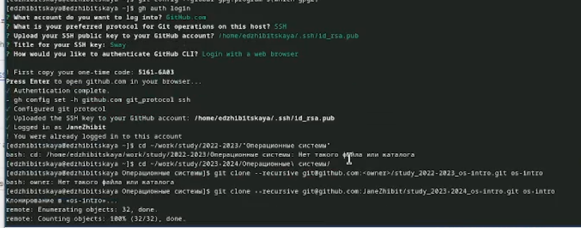
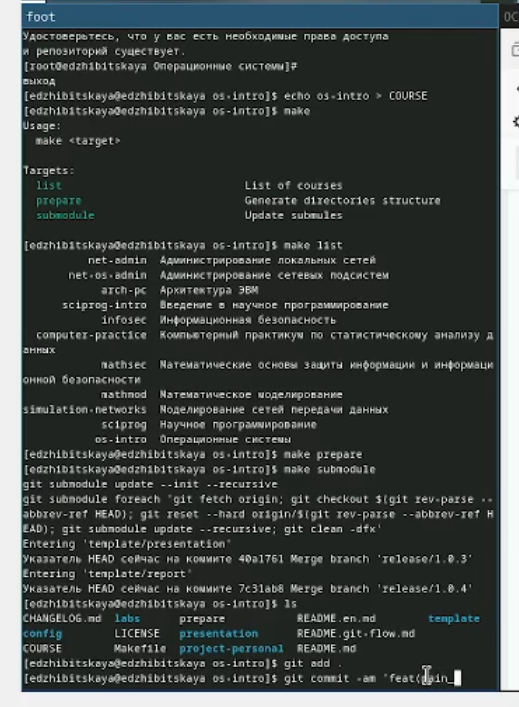
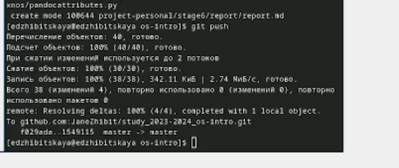

---
## Front matter
title: "Лабораторная работа №2"
subtitle: "Дисциплина: Операционные системы"
author: "Жибицкая Евгения Дмитриевна"

## Generic otions
lang: ru-RU
toc-title: "Содержание"

## Bibliography
bibliography: bib/cite.bib
csl: pandoc/csl/gost-r-7-0-5-2008-numeric.csl

## Pdf output format
toc: true # Table of contents
toc-depth: 2
lof: true # List of figures
lot: true # List of tables
fontsize: 12pt
linestretch: 1.5
papersize: a4
documentclass: scrreprt
## I18n polyglossia
polyglossia-lang:
  name: russian
  options:
	- spelling=modern
	- babelshorthands=true
polyglossia-otherlangs:
  name: english
## I18n babel
babel-lang: russian
babel-otherlangs: english
## Fonts
mainfont: PT Serif
romanfont: PT Serif
sansfont: PT Sans
monofont: PT Mono
mainfontoptions: Ligatures=TeX
romanfontoptions: Ligatures=TeX
sansfontoptions: Ligatures=TeX,Scale=MatchLowercase
monofontoptions: Scale=MatchLowercase,Scale=0.9
## Biblatex
biblatex: true
biblio-style: "gost-numeric"
biblatexoptions:
  - parentracker=true
  - backend=biber
  - hyperref=auto
  - language=auto
  - autolang=other*
  - citestyle=gost-numeric
## Pandoc-crossref LaTeX customization
figureTitle: "Рис."
tableTitle: "Таблица"
listingTitle: "Листинг"
lofTitle: "Список иллюстраций"
lotTitle: "Список таблиц"
lolTitle: "Листинги"
## Misc options
indent: true
header-includes:
  - \usepackage{indentfirst}
  - \usepackage{float} # keep figures where there are in the text
  - \floatplacement{figure}{H} # keep figures where there are in the text
---

# Цель работы

Изучение работы и назначения системы контроля версий git приобретение навыков по работе с ней.

# Выполнение лабораторной работы

Для начала установим git и fh (рис. [-@fig:001]).

{#fig:001 width=70%}

После этого необходимо указать имя и почту (рис. [-@fig:002]), также настроить utf-8 и параметры autocrlf, safecrlf (рис. [-@fig:003]).

{#fig:002 width=70%}

{#fig:003 width=70%}

Далее создаем ключ ssh и ключ pgp (рис. [-@fig:004]).

{#fig:004 width=70%}

На платформе github учетная запись была создана ранее, поэтому просто авторизируемся и добавим созданные ключи туда, скопировав их отпечатки (рис. [-@fig:005]).

{#fig:005 width=70%}

Следующим шагом настроим автоматическую подпись коммитов, введя следующие команды 
(рис. [-@fig:006]).

{#fig:006 width=70%}

Наконец авторизирумся с помощью команды gh login auth и, создав и перейдя в нужные каталоги сначала создадим репозиторий на основе шаблона, а затем клонирукем его себе (рис. [-@fig:007]).

{#fig:007 width=70%}

Также, перейдя в нужный каталог, удалим лишние файла и создадим необходимые каталоги (рис. [-@fig:008]).

{#fig:008 width=70%}

Отправим все изменения на githib (рис. [-@fig:009]).

{#fig:09 width=70%}

# Ответы на контрольные вопросы
1. Что такое системы контроля версий (VCS) и для решения каких задач они предназначаются?
- Они применяются при работе нескольких человек с одним проектом. При внесении изменений позволяют фиксировать, совмещать и возвращать изменения разных людей

2. Объясните следующие понятия VCS и их отношения: хранилище, commit, история, рабочая копия.
- Хранилище - место, где находятся данные(файлы, коды и тд)
- Commit - команда, для сохранения изменений
- История - информация о предыдущих изменениях
- Рабочая копия - одна из версий проекта, с которй ведется работа(= текущая/основная)

3. Что представляют собой и чем отличаются централизованные и децентрализованные VCS? Приведите примеры VCS каждого вида.
- Централизованные системы предполагают наличие единого репозитория для хранения данных(CVC, Subversion)
- В децентрализованных системах центральный репозитроий не обязателен(Git, Bazaar)

4. Опишите действия с VCS при единоличной работе с хранилищем.
Работа происходит на своем компьютере, сначала обновляются данные, в конце они размещаются в центральном репозитории

5. Опишите порядок работы с общим хранилищем VCS.
Для идентификации на сервере необходмы ключи и затем создание репозитория, только затем можно работать на локальной машиной.
Также в конце изменения добавляются на сервер

6. Каковы основные задачи, решаемые инструментальным средством git?
 - хранение информации о всех изменениях
 - обеспечение удобства командной работы
 
7. Назовите и дайте краткую характеристику командам git.
Создание основного дерева репозитория:

git init
Получение обновлений (изменений) текущего дерева из центрального репозитория:

git pull
Отправка всех произведённых изменений локального дерева в центральный репозиторий:

git push
Просмотр списка изменённых файлов в текущей директории:

git status
Просмотр текущих изменений:

git diff
Сохранение текущих изменений:

добавить все изменённые и/или созданные файлы и/или каталоги:

git add .
добавить конкретные изменённые и/или созданные файлы и/или каталоги:

git rm имена_файлов
Сохранение добавленных изменений:

сохранить все добавленные изменения и все изменённые файлы:

git commit -am 'Описание коммита'
сохранить добавленные изменения с внесением комментария через встроенный редактор:

git checkout -b имя_ветки
переключение на некоторую ветку:

git checkout имя_ветки
(при переключении на ветку, которой ещё нет в локальном репозитории, она будет создана и связана с удалённой)
отправка изменений конкретной ветки в центральный репозиторий:

git push origin имя_ветки
слияние ветки с текущим деревом:

git merge --no-ff имя_ветки
Удаление ветки:

удаление локальной уже слитой с основным деревом ветки:

git branch -d имя_ветки
принудительное удаление локальной ветки:

git branch -D имя_ветки
удаление ветки с центрального репозитория:

git push origin :имя_ветки

8. Приведите примеры использования при работе с локальным и удалённым репозиториями.
локальный репозиторий - работа со своими файлами
удаленный репозиторий - совместная работа, общий проект

9. Что такое и зачем могут быть нужны ветви (branches)?
Ветви это пути к отдельным состовдющим (отделы проекта),они дают возможность вносить изменения только в часть проекта и не трогать все вышестоящее 

10. Как и зачем можно игнорировать некоторые файлы при commit?
Игнорировать файлы можно с помощью .gitignore. Нужно это, например, при наличии ненужных(лишних или созданных автоматически) файлов.

# Выводы

В ходе работы была освоена работа с системой контроля версий, был установлен git, проведена авторизация, заданы базовые настройки, создались ключи, клонировадся репозиторий и так далее.

