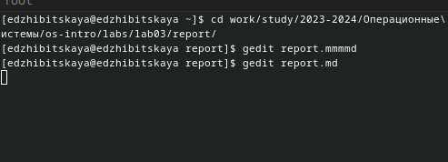
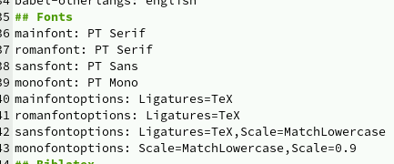
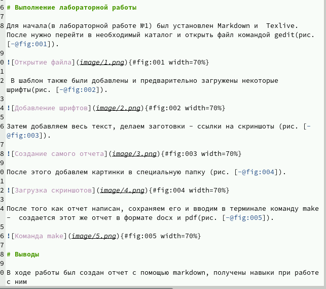
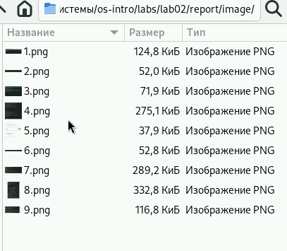

---
## Front matter
lang: ru-RU
title: Лабораторная работа №3
subtitle: Работа с Markdown
author:
  - Жибицкая Евгения Дмитриевна
institute:
  - Российский университет дружбы народов, Москва, Россия
## i18n babel
babel-lang: russian
babel-otherlangs: english

## Formatting pdf
toc: false
toc-title: Содержание
slide_level: 2
aspectratio: 169
section-titles: true
theme: metropolis
header-includes:
 - \metroset{progressbar=frametitle,sectionpage=progressbar,numbering=fraction}
 - '\makeatletter'
 - '\beamer@ignorenonframefalse'
 - '\makeatother'
 
## Fonts
mainfont: PT Serif
romanfont: PT Serif
sansfont: PT Sans
monofont: PT Mono
mainfontoptions: Ligatures=TeX
romanfontoptions: Ligatures=TeX
sansfontoptions: Ligatures=TeX,Scale=MatchLowercase
monofontoptions: Scale=MatchLowercase,Scale=0.9
---

# Цель

## Цели и задачи

- Установить необходимое программное обеспечение.
- Скачать шаблон темы сайта.
- Разместить его на хостинге git.
- Установить параметр для URLs сайта.
- Разместить заготовку сайта на Github pages.

# Ход работы

## Начало работы
:::::::::::::: {.columns align=center}
::: {.column width="50%"}
Предварительно устанавливаем Markdown и  Texlive, затем переходим в каталог и открываем файл md.

:::
::: {.column width="50%"}

:::
::::::::::::::
## Загрузка шрифтов
:::::::::::::: {.columns align=center}
::: {.column width="50%"}

:::
::::::::::::::

## Заполнение
:::::::::::::: {.columns align=center}
::: {.column width="50%"}

:::
::::::::::::::

## Скриншоты
:::::::::::::: {.columns align=center}
::: {.column width="50%"}

:::
::::::::::::::

## Сайт

:::::::::::::: {.columns align=center}
::: {.column width="50%"}

:::
::::::::::::::

# Вывод

## Вывод

В ходе выполнения первого этапа проекта был получен навык  по размещению сайта на github с использованием hugo.

