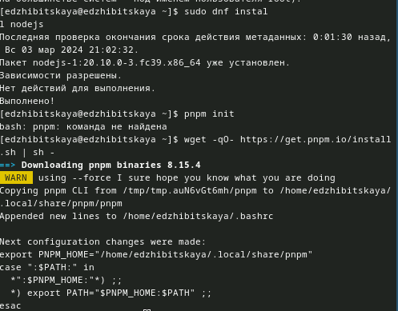
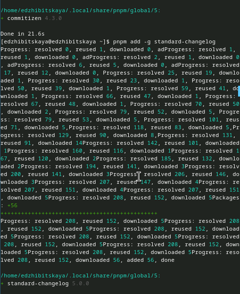
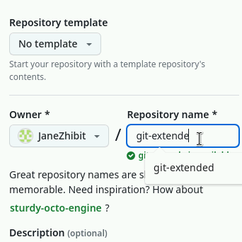
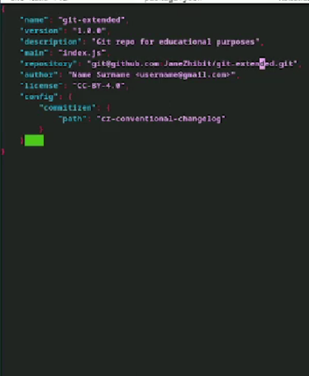
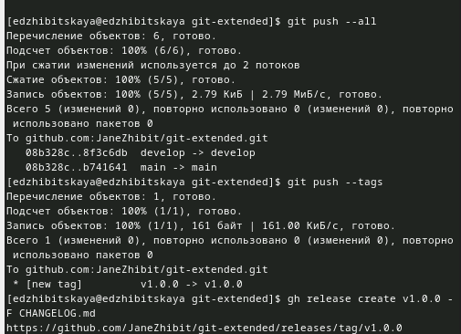
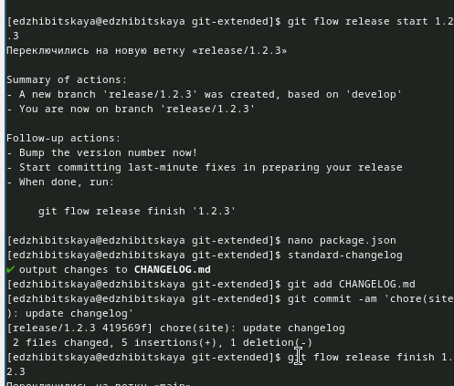
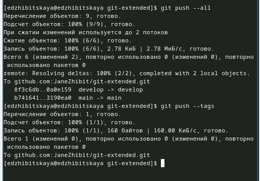

---
## Front matter
lang: ru-RU
title: Лабораторная работа №4
subtitle: Продвинутое использование git
author:
  - Жибицкая Евгения Дмитриевна
institute:
  - Российский университет дружбы народов, Москва, Россия
## i18n babel
babel-lang: russian
babel-otherlangs: english

## Formatting pdf
toc: false
toc-title: Содержание
slide_level: 2
aspectratio: 169
section-titles: true
theme: metropolis
header-includes:
 - \metroset{progressbar=frametitle,sectionpage=progressbar,numbering=fraction}
 - '\makeatletter'
 - '\beamer@ignorenonframefalse'
 - '\makeatother'
 
## Fonts
mainfont: PT Serif
romanfont: PT Serif
sansfont: PT Sans
monofont: PT Mono
mainfontoptions: Ligatures=TeX
romanfontoptions: Ligatures=TeX
sansfontoptions: Ligatures=TeX,Scale=MatchLowercase
monofontoptions: Scale=MatchLowercase,Scale=0.9
---

# Цель

## Цель
Продолжение изучения git и приобретение навыков по  правильной работе с репозиториями

# Ход работы

## Начало работы
:::::::::::::: {.columns align=center}
::: {.column width="50%"}
Установим gitflow, nodejs и pnpm.

:::
::: {.column width="50%"}

:::
::::::::::::::

## Установка общепринятых коммитов
:::::::::::::: {.columns align=center}
::: {.column width="40%"}

:::
::::::::::::::

## Создание репозитория
:::::::::::::: {.columns align=center}
::: {.column width="50%"}

:::
::::::::::::::

## Конфигурация файла
:::::::::::::: {.columns align=center}
::: {.column width="40%"}

:::
::::::::::::::

## Инициализация git flow

:::::::::::::: {.columns align=center}
::: {.column width="50%"}

:::
::::::::::::::
 
## Создание релиза
:::::::::::::: {.columns align=center}
::: {.column width="50%"}
Установим внешнюю ветку вышестоящей, создадим релиз 1.0.0, журнал изменений(и добавим его в индекс), зальем релизную ветку в основную и отправим все на сервер, также создадим релиз на github.

:::
::: {.column width="50%"}

:::
::::::::::::::

## Создание релиза
:::::::::::::: {.columns align=center}
::: {.column width="50%"}

::: 
::: {.column width="50%"}

Создадим ветку для новой функциональности, объединим ветки и создадим версию 1.2.3. релиза и обновим ее номер в файле. Продедаем также те же действия, что и для 1й версии релиза

:::
::::::::::::::

## Создание изменений

:::::::::::::: {.columns align=center}
::: {.column width="50%"}

:::
::::::::::::::

# Вывод

## Вывод

В ходе работы была освоена работа с репозиториями git, gitflow, также были созданы релизы.

