---
## Front matter
title: "Лабораторная работа №4"
subtitle: "Дисциплина: Операционные системы"
author: "Жибицкая Евгения Дмитриевна"

## Generic otions
lang: ru-RU
toc-title: "Содержание"

## Bibliography
bibliography: bib/cite.bib
csl: pandoc/csl/gost-r-7-0-5-2008-numeric.csl

## Pdf output format
toc: true # Table of contents
toc-depth: 2
lof: true # List of figures
lot: true # List of tables
fontsize: 12pt
linestretch: 1.5
papersize: a4
documentclass: scrreprt
## I18n polyglossia
polyglossia-lang:
  name: russian
  options:
	- spelling=modern
	- babelshorthands=true
polyglossia-otherlangs:
  name: english
## I18n babel
babel-lang: russian
babel-otherlangs: english
## Fonts
mainfont: PT Serif
romanfont: PT Serif
sansfont: PT Sans
monofont: PT Mono
mainfontoptions: Ligatures=TeX
romanfontoptions: Ligatures=TeX
sansfontoptions: Ligatures=TeX,Scale=MatchLowercase
monofontoptions: Scale=MatchLowercase,Scale=0.9
## Biblatex
biblatex: true
biblio-style: "gost-numeric"
biblatexoptions:
  - parentracker=true
  - backend=biber
  - hyperref=auto
  - language=auto
  - autolang=other*
  - citestyle=gost-numeric
## Pandoc-crossref LaTeX customization
figureTitle: "Рис."
tableTitle: "Таблица"
listingTitle: "Листинг"
lofTitle: "Список иллюстраций"
lotTitle: "Список таблиц"
lolTitle: "Листинги"
## Misc options
indent: true
header-includes:
  - \usepackage{indentfirst}
  - \usepackage{float} # keep figures where there are in the text
  - \floatplacement{figure}{H} # keep figures where there are in the text
---

# Цель работы

Продолжение изучения git и приобретение навыков по  правильной работе с репозиториями

# Выполнение лабораторной работы

Для начала установим gitflow, предварительно включив репозитории corp(рис. [-@fig:001]).

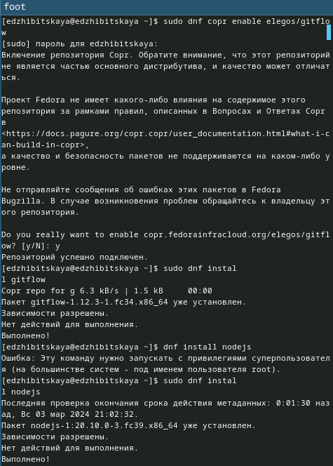{#fig:001 width=70%}

Также скачаем nodejs и pnpm(для этого скопируем и введем в терминал команду с сайта)(рис. [-@fig:002]).

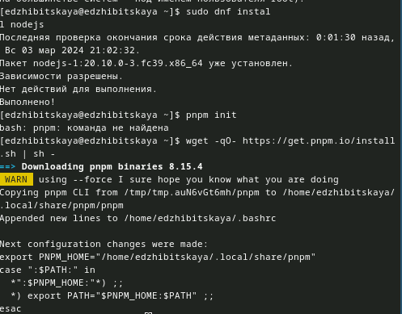{#fig:002 width=70%}

Запустим его, перелогинимся и добавим commitizen(и git-cz), standard-changelog(рис. [-@fig:003]).

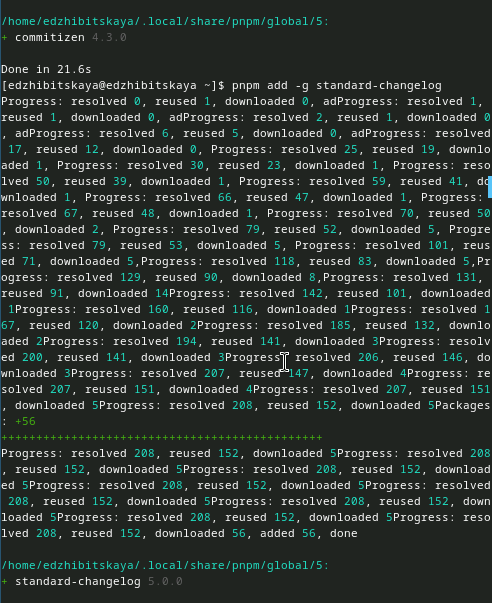{#fig:003 width=70%}

Затем создадим репозиторий git-extended, клонируем, создадим файл и отправим обратно на сервер(рис. [-@fig:004]).

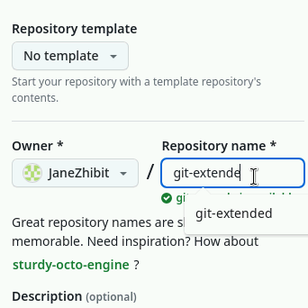{#fig:004 width=70%}

Далее необходимо задать конфигурацию для пакета node.js. Для этого внесем изменения в файл(рис. [-@fig:005]).

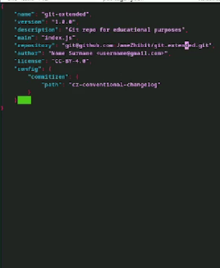{#fig:005 width=70%}

Добавим файлы, инициализируем коммит с помощью cz и отправим изменения(рис. [-@fig:006]).

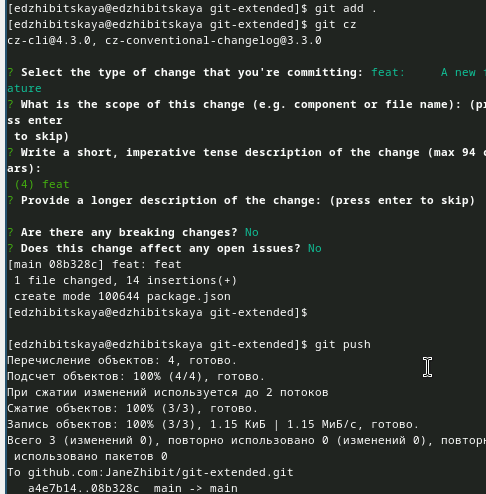{#fig:006 width=70%}

Продолжим работу, инициализируем git flow, установив только префикс v для ярлыков и загрузим на гитхаб(рис. [-@fig:007]).

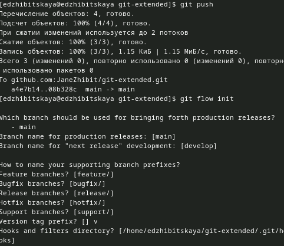{#fig:007 width=70%}

Установим внешнюю ветку вышестоящей, создадим релиз 1.0.0, журнал изменений(и добавим его в индекс), зальем релизную ветку в основную и отправим все на сервер(рис. [-@fig:008]).

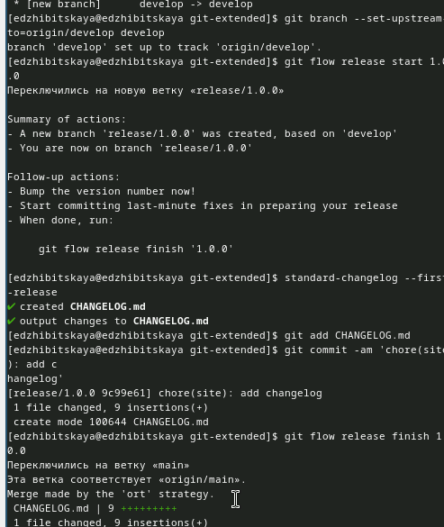{#fig:008 width=70%}

Создадим релиз на github(рис. [-@fig:009]).

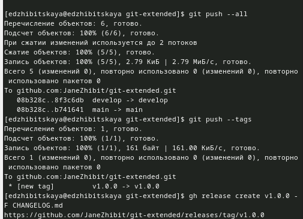{#fig:009 width=70%}

Создадим ветку для новой функциональности, объединим ветки и создадим версию 1.2.3. релиза и обновим ее номер в файле(рис. [-@fig:010]).

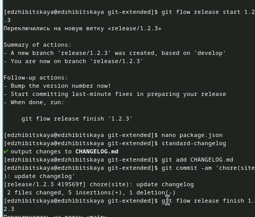{#fig:010 width=70%}

Затем также создадим журнал изменений, добавим его в индекс, зальем релизную ветку на основную и отправим данные на github, создав также релиз с комментарием(рис. [-@fig:011]).

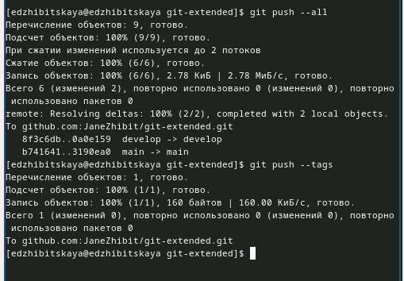{#fig:011 width=70%}

# Выводы

В ходе работы была освоена работа с репозиториями git, gitflow, также были созданы релизы.

# Список литературы{.unnumbered}
[ТУИС](https://esystem.rudn.ru/mod/page/view.php?id=1098937&forceview=1)
