---
## Front matter
lang: ru-RU
title: Лабораторная работа №5
subtitle: Настройка рабочей среды
author:
  - Жибицкая Евгения Дмитриевна
institute:
  - Российский университет дружбы народов, Москва, Россия
## i18n babel
babel-lang: russian
babel-otherlangs: english

## Formatting pdf
toc: false
toc-title: Содержание
slide_level: 2
aspectratio: 169
section-titles: true
theme: metropolis
header-includes:
 - \metroset{progressbar=frametitle,sectionpage=progressbar,numbering=fraction}
 - '\makeatletter'
 - '\beamer@ignorenonframefalse'
 - '\makeatother'
 
## Fonts
mainfont: PT Serif
romanfont: PT Serif
sansfont: PT Sans
monofont: PT Mono
mainfontoptions: Ligatures=TeX
romanfontoptions: Ligatures=TeX
sansfontoptions: Ligatures=TeX,Scale=MatchLowercase
monofontoptions: Scale=MatchLowercase,Scale=0.9
---

# Цель

## Цель
Освоение менеджера паролей pass, приобретение навыков по настройке рабочей среды.

# Ход работы

## Установка pass и gopass
:::::::::::::: {.columns align=center}
::: {.column width="45%"}
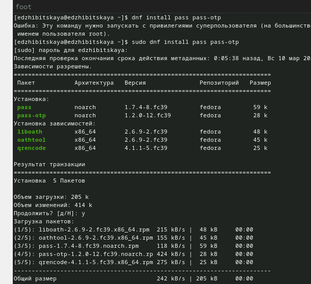

:::
::: {.column width="45%"}

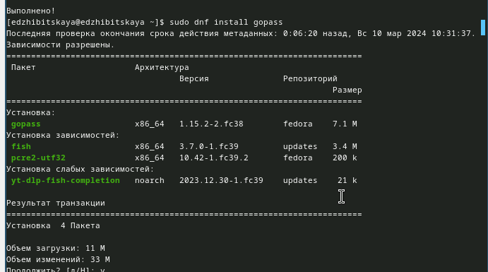

:::
::::::::::::::

## Инициализация и создание структуры
:::::::::::::: {.columns align=center}
::: {.column width="50%"}

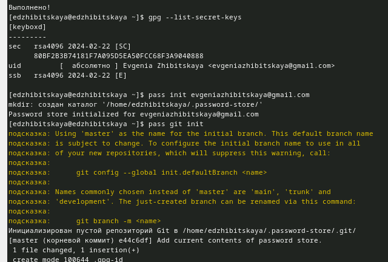
:::
::::::::::::::

## Синхронизация и сохранение
:::::::::::::: {.columns align=center}
::: {.column width="45%"}
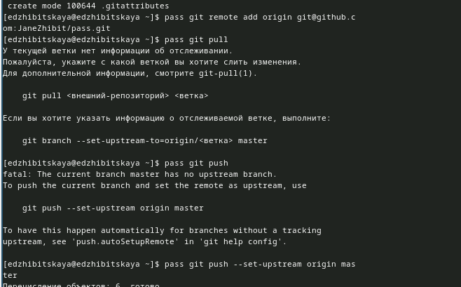

:::
::: {.column width="45%"}

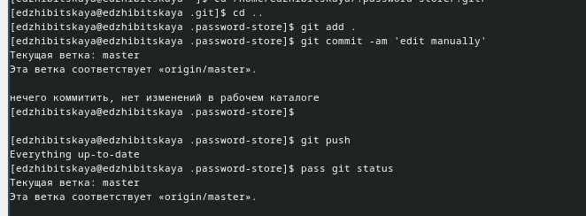

:::
::::::::::::::

## Настройка интерфейса с  броузером

:::::::::::::: {.columns align=center}
::: {.column width="50%"}

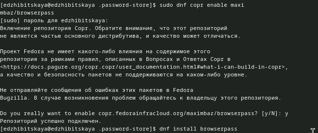
:::
::::::::::::::
 
## Работа с паролями
:::::::::::::: {.columns align=center}
::: {.column width="50%"}

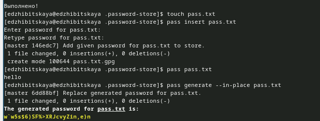

:::
::::::::::::::

## Установка ПО и шрифтов
:::::::::::::: {.columns align=center}
::: {.column width="45%"}

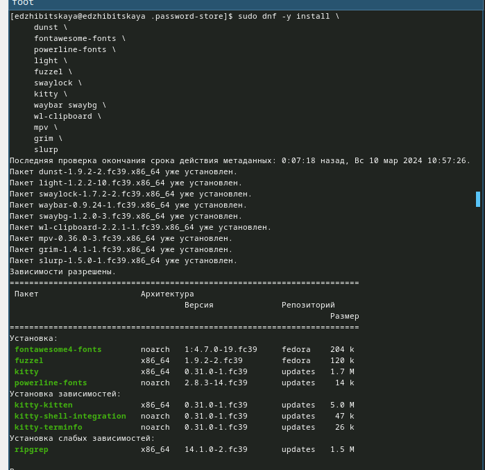
::: 
::: {.column width="45%"}

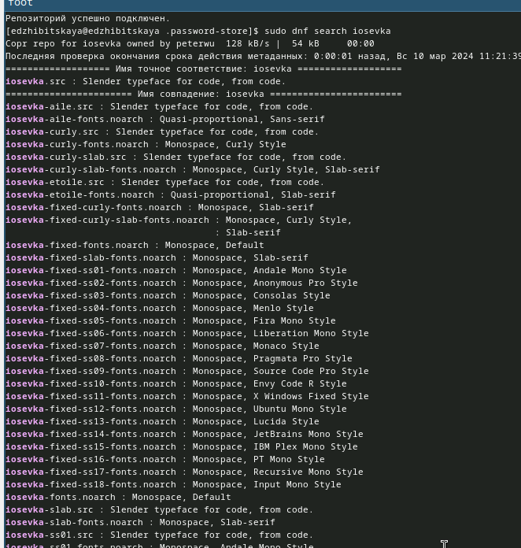

:::
::::::::::::::

## Chezmoi
:::::::::::::: {.columns align=center}
::: {.column width="50%"}

 Установим бинарный файл с помощью wget командой sh -c "$(wget -qO- chezmoi.io/get)".
Создадим свой репозиторий на основе шаблона и с инициализируем chezmoi c репозиторием
::: 
::: {.column width="50%"}

:::
::::::::::::::

## Работа с другой машиной
:::::::::::::: {.columns align=center}
::: {.column width="50%"}

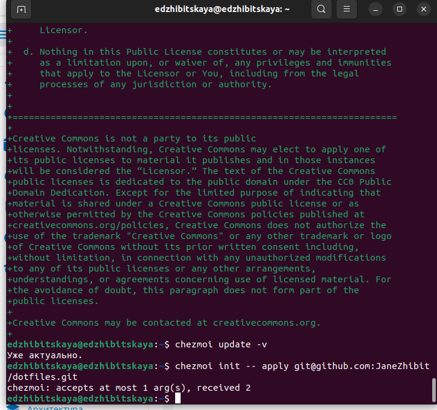

:::
::::::::::::::

## Автоматическое добавление изменений
:::::::::::::: {.columns align=center}
::: {.column width="50%"}

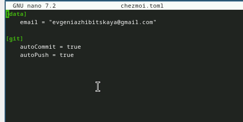

:::
::::::::::::::

# Вывод

## Вывод

В ходе работы была произведена настройка рабочей среды, призошло знакомство с менедеджером pass и chezmoi.

