---
## Front matter
title: "Лабораторная работа №5"
subtitle: "Дисциплина: Операционные системы"
author: "Жибицкая Евгения Дмитриевна"

## Generic otions
lang: ru-RU
toc-title: "Содержание"

## Bibliography
bibliography: bib/cite.bib
csl: pandoc/csl/gost-r-7-0-5-2008-numeric.csl

## Pdf output format
toc: true # Table of contents
toc-depth: 2
lof: true # List of figures
lot: true # List of tables
fontsize: 12pt
linestretch: 1.5
papersize: a4
documentclass: scrreprt
## I18n polyglossia
polyglossia-lang:
  name: russian
  options:
	- spelling=modern
	- babelshorthands=true
polyglossia-otherlangs:
  name: english
## I18n babel
babel-lang: russian
babel-otherlangs: english
## Fonts
mainfont: PT Serif
romanfont: PT Serif
sansfont: PT Sans
monofont: PT Mono
mainfontoptions: Ligatures=TeX
romanfontoptions: Ligatures=TeX
sansfontoptions: Ligatures=TeX,Scale=MatchLowercase
monofontoptions: Scale=MatchLowercase,Scale=0.9
## Biblatex
biblatex: true
biblio-style: "gost-numeric"
biblatexoptions:
  - parentracker=true
  - backend=biber
  - hyperref=auto
  - language=auto
  - autolang=other*
  - citestyle=gost-numeric
## Pandoc-crossref LaTeX customization
figureTitle: "Рис."
tableTitle: "Таблица"
listingTitle: "Листинг"
lofTitle: "Список иллюстраций"
lotTitle: "Список таблиц"
lolTitle: "Листинги"
## Misc options
indent: true
header-includes:
  - \usepackage{indentfirst}
  - \usepackage{float} # keep figures where there are in the text
  - \floatplacement{figure}{H} # keep figures where there are in the text
---

# Цель работы

Освоение менеджера паролей pass, приобретение навыков по настройке рабочей среды.

# Выполнение лабораторной работы

Для начала работы необходимо установить pass и gopass(рис. [-@fig:001]) и (рис. [-@fig:002]).

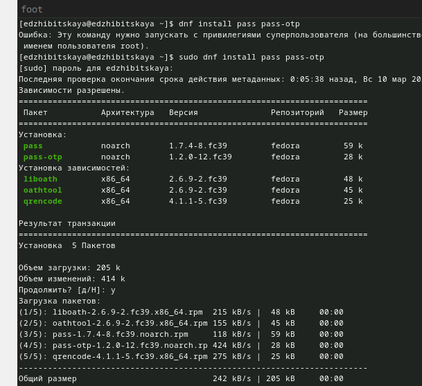{#fig:001 width=70%}

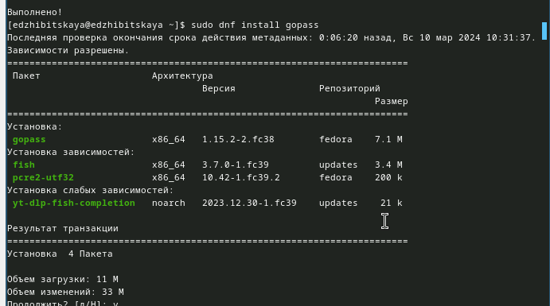{#fig:002 width=70%}

Перейдем к настройке, проверим, что ключ gpg уже есть и инициализируем хранилище с помощью почты(рис. [-@fig:003]), также сразу командой pass git init создадим структуру.

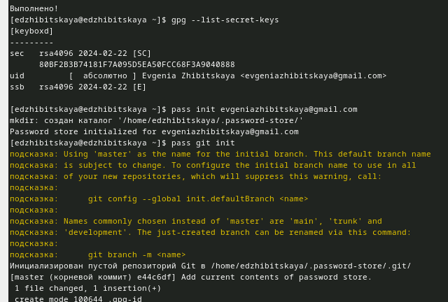{#fig:003 width=70%}

Создадим репозиторий pass и зададим ему адрес на хостинге, выполним команды для синхронизации(рис. [-@fig:004]).

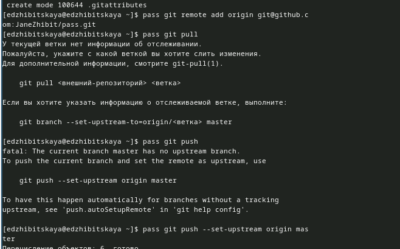{#fig:004 width=70%}

Для отслеживания сделанных в файловой системе изменений закоммитим и выложим их вручную (рис. [-@fig:005]).

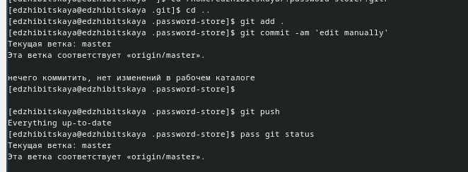{#fig:005 width=70%}

Затем необходимо настроить интерфейс с браузером, установив плагин и выполнив следующие команды(рис. [-@fig:006]).

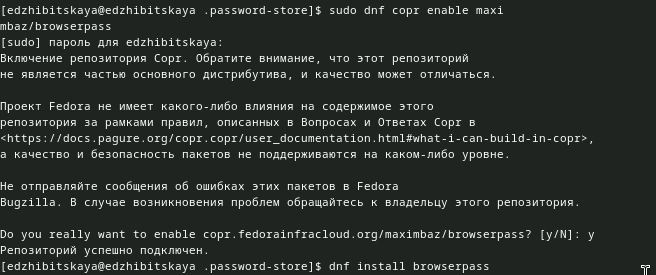{#fig:006 width=70%}

Далее создадим файл, установим ему пароль, просмотрим его, а затем сгенерируем новый (рис. [-@fig:007]).

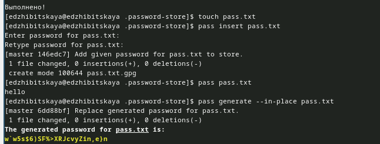{#fig:007 width=70%}

Следующим шагом мы установим дополнительное ПО, а также шрифты (рис. [-@fig:008]) и (рис. [-@fig:009]).

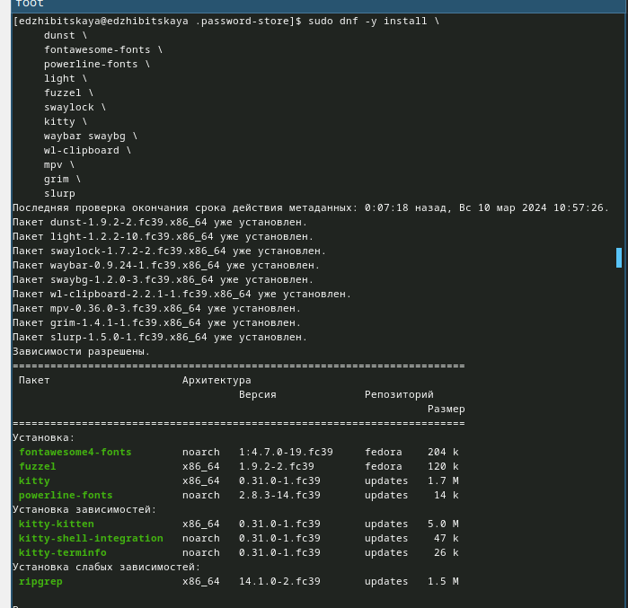{#fig:008 width=70%}

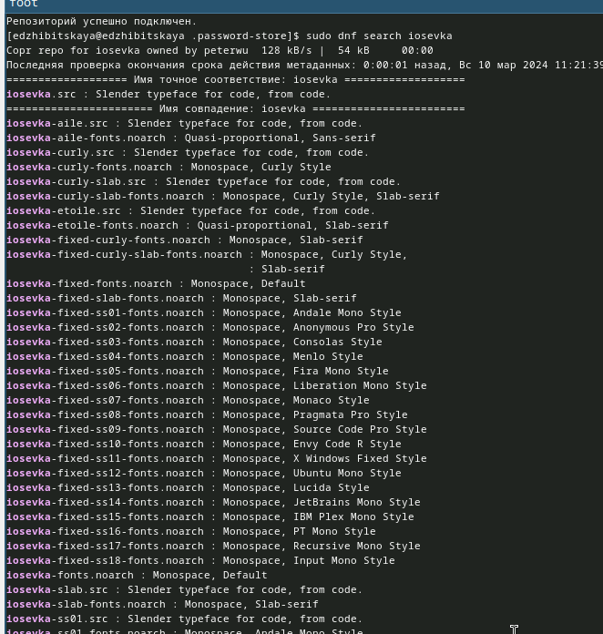{#fig:009 width=70%}

Также установим бинарный файл с помощью wget командой sh -c "$(wget -qO- chezmoi.io/get)".
Создадим свой репозиторий на основе шаблона и инициализируем chezmoi c репозиторием (рис. [-@fig:010]).

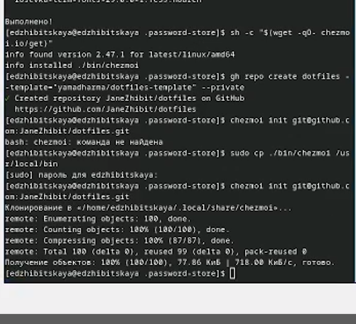{#fig:010 width=70%}

Проверим изменения и добавим их (рис. [-@fig:011]).

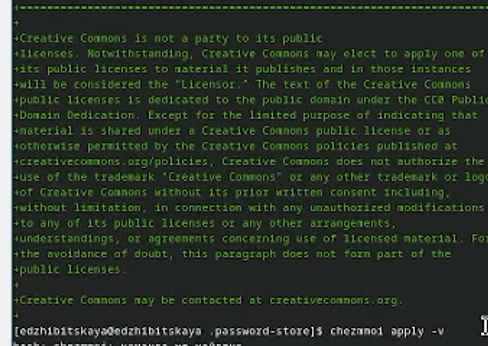{#fig:011 width=70%}

Выполним те же действия на другой машине(инициализация chezmoi, проверка и добавление изменений, также здесь мы еще устанавливаем dotfiles на компьютер с помощью chezmoi init --apply) (рис. [-@fig:012]).

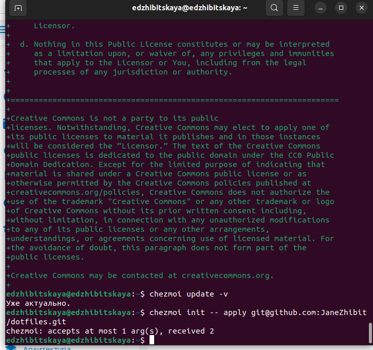{#fig:012 width=70%}

Затем извлечем изменения(chezmoi update, chezmoi apply) и в файле ~/.config/chezmoi/chezmoi.toml устаном все параметры на true - для автоматической фмксации и отправки изменений(рис. [-@fig:013]).

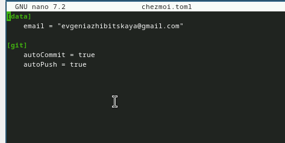{#fig:013 width=70%}

# Выводы

В ходе работы была произведена настройка рабочей среды, призошло знакомство с менедеджерм pass и chezmoi.

# Список литературы{.unnumbered}
 [ТУИС](https://esystem.rudn.ru/mod/page/view.php?id=1098939)
