---
## Front matter
lang: ru-RU
title: Лабораторная работа № 6
subtitle: Работа с командной строкой
author:
  - Жибицкая Евгения Дмитриевна
institute:
  - Российский университет дружбы народов, Москва, Россия
## i18n babel
babel-lang: russian
babel-otherlangs: english

## Formatting pdf
toc: false
toc-title: Содержание
slide_level: 2
aspectratio: 169
section-titles: true
theme: metropolis
header-includes:
 - \metroset{progressbar=frametitle,sectionpage=progressbar,numbering=fraction}
 - '\makeatletter'
 - '\beamer@ignorenonframefalse'
 - '\makeatother'
 
## Fonts
mainfont: PT Serif
romanfont: PT Serif
sansfont: PT Sans
monofont: PT Mono
mainfontoptions: Ligatures=TeX
romanfontoptions: Ligatures=TeX
sansfontoptions: Ligatures=TeX,Scale=MatchLowercase
monofontoptions: Scale=MatchLowercase,Scale=0.9
---

# Цель

## Цель

Приобретение практических навыков по работе с системой посредством командной строки.

# Ход работы

## Домашний каталог
:::::::::::::: {.columns align=center}
::: {.column width="45%"}
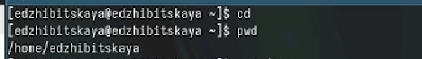

:::
::::::::::::::

## Содержимое каталога tmp
:::::::::::::: {.columns align=center}
::: {.column width="45%"}

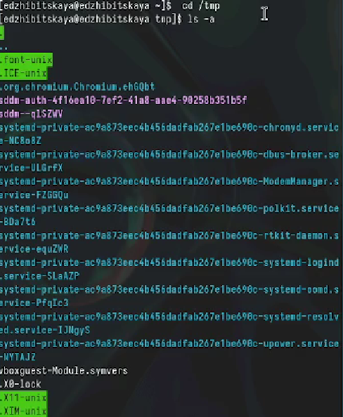
:::
::: {.column width="50%"}

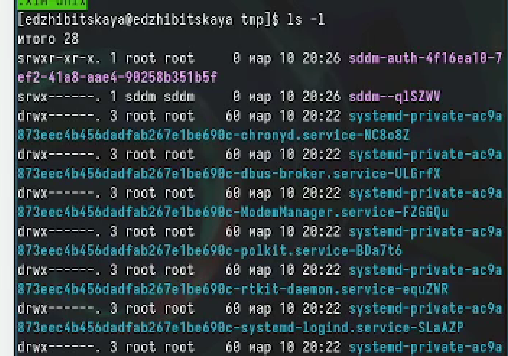
:::
::::::::::::::

## Поиск подкаталога cron

:::::::::::::: {.columns align=center}
::: {.column width="50%"}

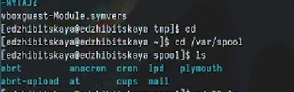
:::
::::::::::::::

## Содержимое домашнего каталога вместе с указанием владельца
:::::::::::::: {.columns align=center}
::: {.column width="50%"}

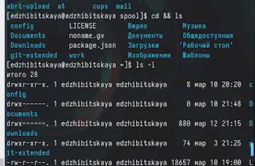
:::
::::::::::::::

## Создание и удаление каталогов
:::::::::::::: {.columns align=center}
::: {.column width="45%"}

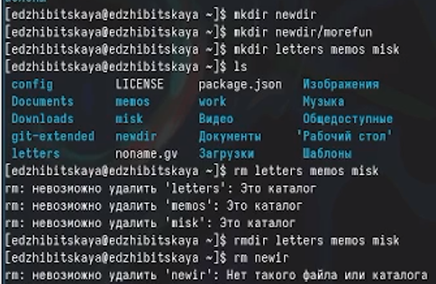
::: 
::: {.column width="45%"}

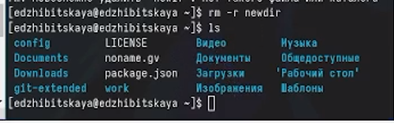

:::
::::::::::::::

## Команда ls и ее ключи
:::::::::::::: {.columns align=center}
::: {.column width="50%"}

 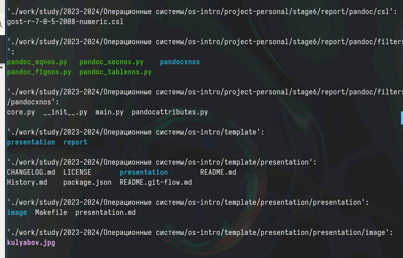
::: 
::: {.column width="50%"}

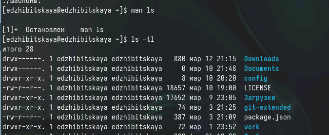

:::
::::::::::::::

## Ознакомление с командами и их ключами
:::::::::::::: {.columns align=center}
::: {.column width="50%"}

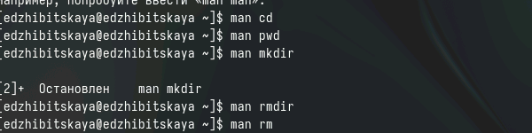

:::
::::::::::::::

## Ключи  к командам

- cd .. - каталог выше
- cd _ - предыдущая директория 
- mkdir -p или --parents  - coздать все директории, которые указаны внутри пути. Если какая-либо директория существует, то предупреждение об этом не выводится.
- mkdir -v или --verbose - выводить сообщение о каждой создаваемой директории.
- rm -r - рекурсивное удаление
- rm -i - подтверждение перед удалением

## History и ее модификации
:::::::::::::: {.columns align=center}
::: {.column width="45%"}

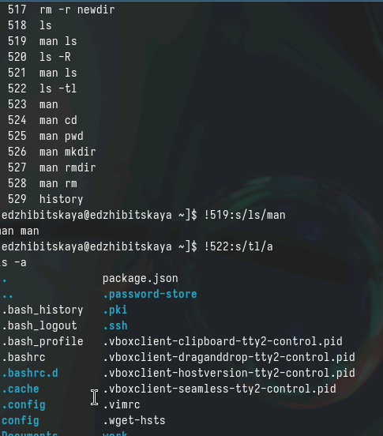

:::
::::::::::::::

# Вывод

## Вывод

В ходе работы было произведено знакомство с различными командами для работы с систеомй, приобретены различные навыки.

