---
## Front matter
title: "Лабораторная работа №6"
subtitle: "Дисциплина: Операционные системы"
author: "Жибицкая Евгения Дмитриевна"

## Generic otions
lang: ru-RU
toc-title: "Содержание"

## Bibliography
bibliography: bib/cite.bib
csl: pandoc/csl/gost-r-7-0-5-2008-numeric.csl

## Pdf output format
toc: true # Table of contents
toc-depth: 2
lof: true # List of figures
lot: true # List of tables
fontsize: 12pt
linestretch: 1.5
papersize: a4
documentclass: scrreprt
## I18n polyglossia
polyglossia-lang:
  name: russian
  options:
	- spelling=modern
	- babelshorthands=true
polyglossia-otherlangs:
  name: english
## I18n babel
babel-lang: russian
babel-otherlangs: english
## Fonts
mainfont: PT Serif
romanfont: PT Serif
sansfont: PT Sans
monofont: PT Mono
mainfontoptions: Ligatures=TeX
romanfontoptions: Ligatures=TeX
sansfontoptions: Ligatures=TeX,Scale=MatchLowercase
monofontoptions: Scale=MatchLowercase,Scale=0.9
## Biblatex
biblatex: true
biblio-style: "gost-numeric"
biblatexoptions:
  - parentracker=true
  - backend=biber
  - hyperref=auto
  - language=auto
  - autolang=other*
  - citestyle=gost-numeric
## Pandoc-crossref LaTeX customization
figureTitle: "Рис."
tableTitle: "Таблица"
listingTitle: "Листинг"
lofTitle: "Список иллюстраций"
lotTitle: "Список таблиц"
lolTitle: "Листинги"
## Misc options
indent: true
header-includes:
  - \usepackage{indentfirst}
  - \usepackage{float} # keep figures where there are in the text
  - \floatplacement{figure}{H} # keep figures where there are in the text
---

# Цель работы

Приобретение практических навыков по работе с системой посредством командной строки.

# Выполнение лабораторной работы

Убедимся, что находимся в домашнем каталоге и с помощью команды pwd узнаем абсолютный путь к нему.(рис. [-@fig:001]).

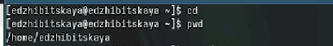{#fig:001 width=70%}

Перейдем в каталог tmp и выведем его содержимое, используя разные ключи. В первом случае мы выводим еще и скрытые файлы, во втором болеее подробная информация в целом(рис. [-@fig:002]) и (рис. [-@fig:003]).

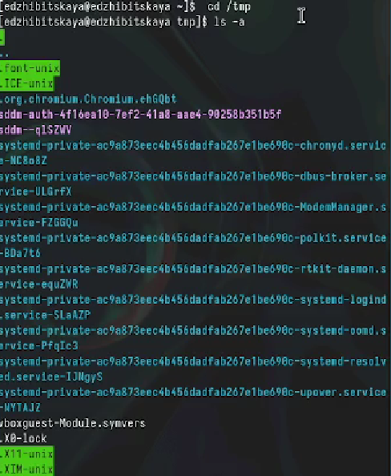{#fig:002 width=70%}

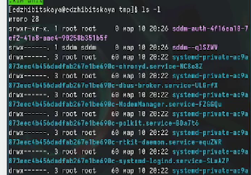{#fig:003 width=70%}

Проверим также что в каталоге /var/spool есть подкаталог с именем cron (рис. [-@fig:004]).

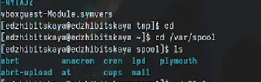{#fig:004 width=70%}

Далее переходим в домашний каталог и там смотрим его содержимое(смотрим владельца файлов) (рис. [-@fig:005]).

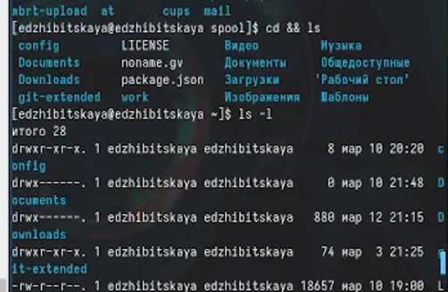{#fig:005 width=70%}

Следующим этапом создадим новый каталог, а затем и подкаталог, также одной командой создадим еще 3 каталога и проверим, что все получилось. Сразу же удалим эти каталоги (рис. [-@fig:006]).

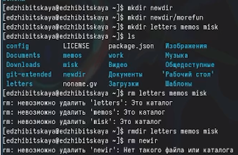{#fig:006 width=70%}

Удалим каталог newdir(содержащий подкаталог) командой rm -r, убедимся, что он удалися (рис. [-@fig:007]).

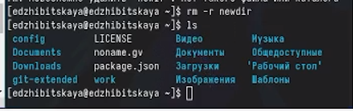{#fig:007 width=70%}

Командой man ls найдем необходимый нам ключ -R для выведения не только каталогов, но и подкаталогов и файлов(рис. [-@fig:008]). Также найдем комбинацию ключей для отсортированного по времени и с информацией о владельце вывода (рис. [-@fig:009])

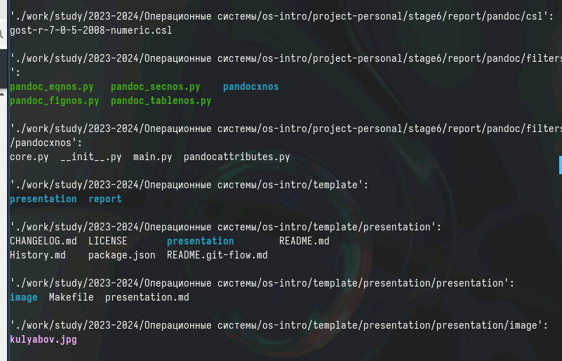{#fig:008 width=70%}

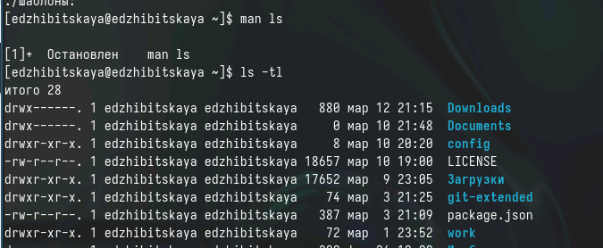{#fig:009 width=70%}

Кроме того воспользуемся этой же командой для ознакомления со следующими командами (рис. [-@fig:010])
- cd .. - каталог выше
- cd _ - предыдущая директория 
- mkdir -p или --parents  - coздать все директории, которые указаны внутри пути. Если какая-либо директория существует, то предупреждение об этом не выводится.
- mkdir -v или --verbose - выводить сообщение о каждой создаваемой директории.
- rm -r - рекурсивное удаление
- rm -i - подтверждение перед удалением

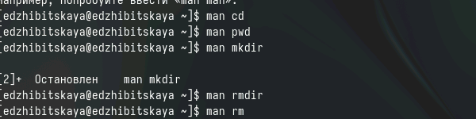{#fig:010 width=70%}

Последнее, что мы сделаем, это с помощью команды history посмотрим на все предыдущие команды и, модифицировав их, воспользуемся ими еще раз(рис. [-@fig:011])

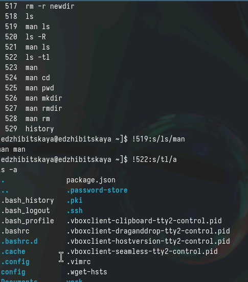{#fig:011 width=70%}

# Выводы

В ходе работы было произведено знакомство с различными командами для работы с систеомй, приобретены различные навыки.

# Список литературы{.unnumbered}
[ТУИС](https://esystem.rudn.ru/course/view.php?id=5790)
