---
## Front matter
lang: ru-RU
title: Лабораторная работа № 7
subtitle: Работа с файлами и каталогами
author:
  - Жибицкая Евгения Дмитриевна
institute:
  - Российский университет дружбы народов, Москва, Россия
## i18n babel
babel-lang: russian
babel-otherlangs: english

## Formatting pdf
toc: false
toc-title: Содержание
slide_level: 2
aspectratio: 169
section-titles: true
theme: metropolis
header-includes:
 - \metroset{progressbar=frametitle,sectionpage=progressbar,numbering=fraction}
 - '\makeatletter'
 - '\beamer@ignorenonframefalse'
 - '\makeatother'
 
## Fonts
mainfont: PT Serif
romanfont: PT Serif
sansfont: PT Sans
monofont: PT Mono
mainfontoptions: Ligatures=TeX
romanfontoptions: Ligatures=TeX
sansfontoptions: Ligatures=TeX,Scale=MatchLowercase
monofontoptions: Scale=MatchLowercase,Scale=0.9
---

# Цель

## Цель

Знакомство с файловой системой и каталогами. Приобретение навыков по работе с ней: создание, удаление, копирование и перемещение файлов и каталогов. Работа с правами доступа

# Ход работы

## Выполнение примеров из первой части
:::::::::::::: {.columns align=center}
::: {.column width="45%"}

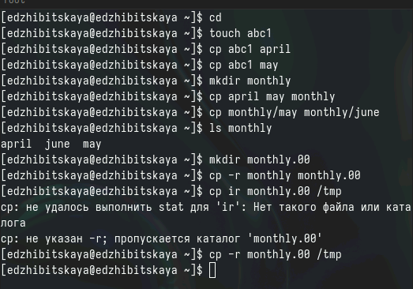
:::
::: {.column width="50%"}

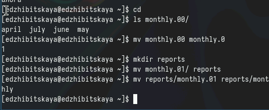
:::
::::::::::::::

## Выполнение примеров из первой части
:::::::::::::: {.columns align=center}
::: {.column width="45%"}

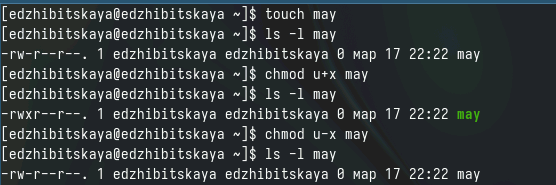
:::
::: {.column width="50%"}

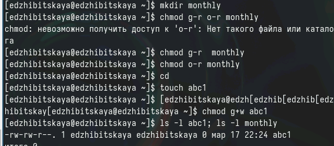
:::
::::::::::::::

## Пункт 2
:::::::::::::: {.columns align=center}
::: {.column width="45%"}

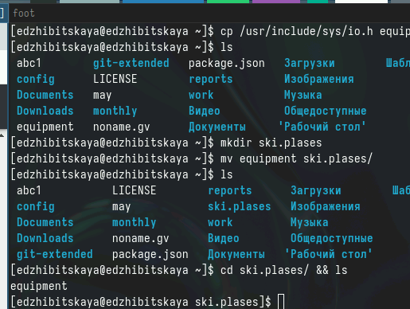
:::
::: {.column width="50%"}

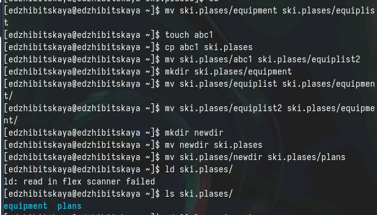
:::
::::::::::::::

## Пункт 3. Права доступа
:::::::::::::: {.columns align=center}
::: {.column width="50%"}

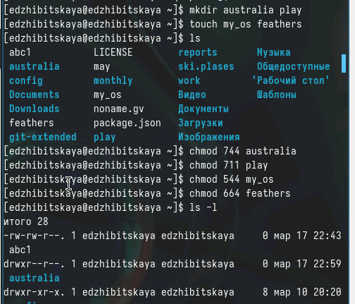
:::
::::::::::::::

## Пункт 4
:::::::::::::: {.columns align=center}
::: {.column width="45%"}

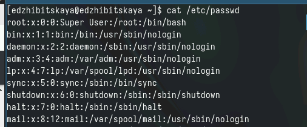
::: 
::: {.column width="45%"}

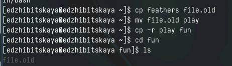

:::
::::::::::::::

## Пункт 4
:::::::::::::: {.columns align=center}
::: {.column width="50%"}

 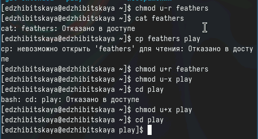
::: 
::::::::::::::

## Пункт 5
:::::::::::::: {.columns align=center}
::: {.column width="50%"}

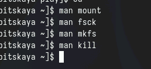

:::
::::::::::::::

## Пункт 5

- Mount

команда позволяет присоединять файловые системы разных устройств 

mount /dev/cdrom

- fsck = file system check

команда для проверки и восстановления файловых систем

fsck <опции> <файл. система>

- mkfs = make file system

команда создания файловой системы на жестком диcке или флэшке

- kill

команда прекращения процесса

kill <номер процесса>

# Вывод

## Вывод

В ходе работы были приобретены навыки по работе с файловой системой: были созданы различные файлы и каталоги, производилось наделение их правами, перемещение, копирование и т.п.

