---
## Front matter
title: "Лабораторная работа №7"
subtitle: "Дисциплина: Операционные системы"
author: "Жибицкая Евгения Дмитриевна"

## Generic otions
lang: ru-RU
toc-title: "Содержание"

## Bibliography
bibliography: bib/cite.bib
csl: pandoc/csl/gost-r-7-0-5-2008-numeric.csl

## Pdf output format
toc: true # Table of contents
toc-depth: 2
lof: true # List of figures
lot: true # List of tables
fontsize: 12pt
linestretch: 1.5
papersize: a4
documentclass: scrreprt
## I18n polyglossia
polyglossia-lang:
  name: russian
  options:
	- spelling=modern
	- babelshorthands=true
polyglossia-otherlangs:
  name: english
## I18n babel
babel-lang: russian
babel-otherlangs: english
## Fonts
mainfont: PT Serif
romanfont: PT Serif
sansfont: PT Sans
monofont: PT Mono
mainfontoptions: Ligatures=TeX
romanfontoptions: Ligatures=TeX
sansfontoptions: Ligatures=TeX,Scale=MatchLowercase
monofontoptions: Scale=MatchLowercase,Scale=0.9
## Biblatex
biblatex: true
biblio-style: "gost-numeric"
biblatexoptions:
  - parentracker=true
  - backend=biber
  - hyperref=auto
  - language=auto
  - autolang=other*
  - citestyle=gost-numeric
## Pandoc-crossref LaTeX customization
figureTitle: "Рис."
tableTitle: "Таблица"
listingTitle: "Листинг"
lofTitle: "Список иллюстраций"
lotTitle: "Список таблиц"
lolTitle: "Листинги"
## Misc options
indent: true
header-includes:
  - \usepackage{indentfirst}
  - \usepackage{float} # keep figures where there are in the text
  - \floatplacement{figure}{H} # keep figures where there are in the text
---

# Цель работы

Знакомство с файловой системой и каталогами. Приобретение навыков по работе с ней: создание, копирование и перемещение файлов и каталогов, работа с правами доступа

# Задание

1. Выполните все примеры, приведённые в первой части описания лабораторной работы.
2. Выполните следующие действия, зафиксировав в отчёте по лабораторной работе
используемые при этом команды и результаты их выполнения:
 - Скопируйте файл /usr/include/sys/io.h в домашний каталог и назовите его
equipment. Если файла io.h нет, то используйте любой другой файл в каталоге
/usr/include/sys/ вместо него.
 -  В домашнем каталоге создайте директорию ~/ski.plases.
 - Переместите файл equipment в каталог ~/ski.plases.
 - Переименуйте файл ~/ski.plases/equipment в ~/ski.plases/equiplist.
 - Создайте в домашнем каталоге файл abc1 и скопируйте его в каталог
~/ski.plases, назовите его equiplist2.
 - Создайте каталог с именем equipment в каталоге ~/ski.plases.
 - Переместите файлы ~/ski.plases/equiplist и equiplist2 в каталог
~/ski.plases/equipment.
 -  Создайте и переместите каталог ~/newdir в каталог ~/ski.plases и назовите
его plans.

3. Определите опции команды chmod, необходимые для того, чтобы присвоить перечисленным ниже файлам выделенные права доступа, считая, что в начале таких прав
нет:
 - drwxr--r-- ... australia
 - drwx--x--x ... play
 - -r-xr--r-- ... my_os
 - -rw-rw-r-- ... feathers
При необходимости создайте нужные файлы.
4. Проделайте приведённые ниже упражнения, записывая в отчёт по лабораторной
работе используемые при этом команды:
 -  Просмотрите содержимое файла /etc/password.
 -  Скопируйте файл ~/feathers в файл ~/file.old.
 -  Переместите файл ~/file.old в каталог ~/play.
 -  Скопируйте каталог ~/play в каталог ~/fun.
 -  Переместите каталог ~/fun в каталог ~/play и назовите его games.
 -  Лишите владельца файла ~/feathers права на чтение.
 -  Что произойдёт, если вы попытаетесь просмотреть файл ~/feathers командой
cat?
 -  Что произойдёт, если вы попытаетесь скопировать файл ~/feathers?
 -  Дайте владельцу файла ~/feathers право на чтение.
 -  Лишите владельца каталога ~/play права на выполнение.
 - Перейдите в каталог ~/play. Что произошло?
 -  Дайте владельцу каталога ~/play право на выполнение.
5. Прочитайте man по командам mount, fsck, mkfs, kill и кратко их охарактеризуйте, приведя примеры.
ъ
# Выполнение лабораторной работы

1. Первым заданием было выполнить все примеры из первой части работы. Для этого мы создали файл, скопировали его в другие. Здесь же мы создали каталоги скопировали туда эти файлы.(рис. [-@fig:001]).

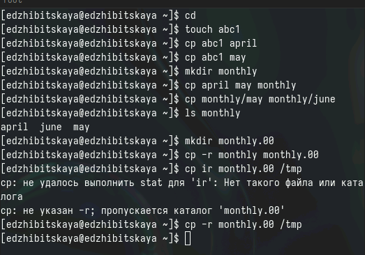{#fig:001 width=70%}

Затем переименуем файл april в july, переместим файлы, посмотрим содержимое каталога.Также переименуем каталог в monthly.01, создадим еще один каталог и переместим первый каталог в новый, переименуем их(рис. [-@fig:002]).

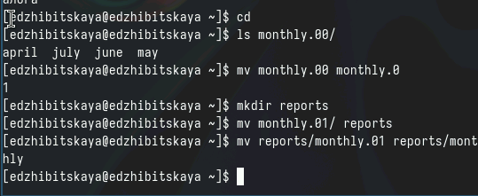{#fig:002 width=70%}

Еще нам необходимо поработать с правами доступа. Для этого создадим файл may, сначала наделим, а потом лишим его прав доступа(рис. [-@fig:003]), создадим еще каталог monthly, запретим его чтение, также создадим файл abc1 с правом записи(рис. [-@fig:004]).

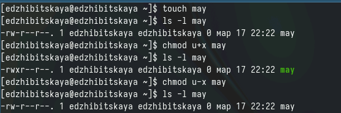{#fig:003 width=70%}

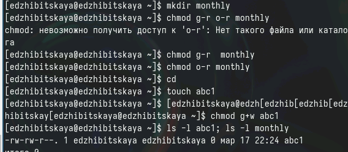{#fig:004 width=70%}

2. Вторым заданием надо было выполнить описанные ниже действия.
Для начала создадим каталог ~/ski.plases, переместим туда файл equipment(рис. [-@fig:005]). 

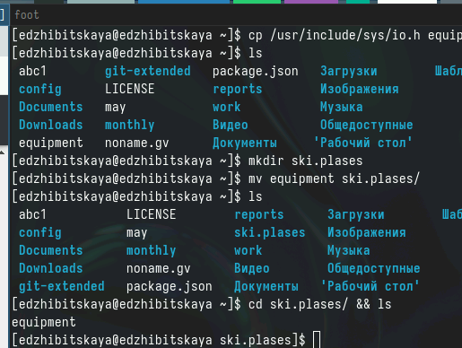{#fig:005 width=70%}

Переименуем файл. Создадим файл abс1 и переименуем в equiplist2. Создаим каталог, переместим в него предыдущие файлы, еще создадим каталог plans, переместив и переименовав его из newdir(рис. [-@fig:006]). 

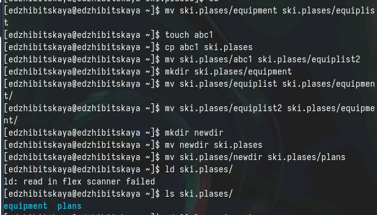{#fig:006 width=70%}

3. Перейдем к 3 пункту, в котором нам надо наделить определенные файлы правами. 
Создадим эти файлы и , введя необходимые комбинации команды chmod разрешим опреденные действия с ними(рис. [-@fig:005]). 

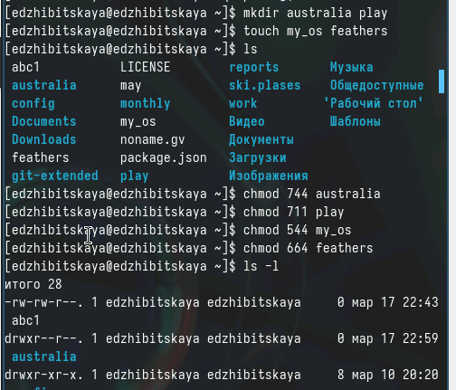{#fig:007 width=70%}

4. Здесь мы также выполним приведенные ниже действия.
Просмотрим содержимое файла (рис. [-@fig:008]). 

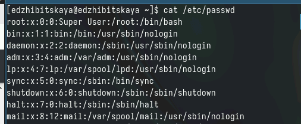{#fig:008 width=70%}

Потом скопируем файл и переместим его в каталог play. Скопируем весь каталог в каталог fun, переименуем его (рис. [-@fig:009]) и (рис. [-@fig:010]). 

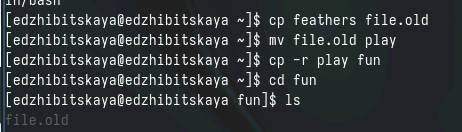{#fig:009 width=
70%}

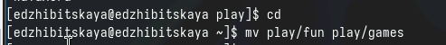{#fig:010 width=70%}

Лишим владельца feathers права на чтение, попытаемся просмотреть и скопировать файл - безуспешно; вернем право на чтение. 
Лишим права на выполнение каталог play. Попробуем перейти в него - запрет. Вернем право на выполнение (рис. [-@fig:011]). 

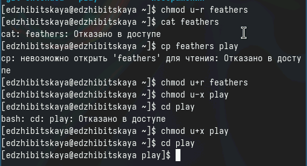{#fig:011 width=70%}

5. Последним пунктом ознакомимся с некоторыми командами, охарактеризуем их (рис. [-@fig:012]). 

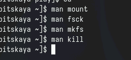{#fig:012 width=70%}

- Mount
команда позволяет присоединять файловые системы разных устройств 
mount /dev/cdrom

- fsck = file system check
команда для проверки и восстановления файловых систем
fsck <опции> <файл. система>

- mkfs = make file system
команда создания файловой системы на жестком димке или флэшке

- kill
команда прекращения процесса
kill <номер процесса>

# Контрольные вопросы

1. Приведите общую структуру файловой системы и дайте характеристику каждой директории первого уровня этой структуры.
/ — root каталог. Содержит в себе всю иерархию системы;

/bin — здесь находятся двоичные исполняемые файлы. 

/boot — тут расположены файлы, используемые для загрузки системы (образ initrd, ядро vmlinuz);

/dev —  файлы устройств (драйверов). С помощью этих файлов можно взаимодействовать с устройствами.

/etc —  файлы конфигураций программ. Эти файлы позволяют настраивать системы, сервисы, скрипты системных демонов;

/home — каталог, аналогичный каталогу Users в Windows. 

/lib — содержит системные библиотеки, с которыми работают программы и модули ядра;

/mnt — точка временного монтирования. Файловые системы подключаемых устройств обычно монтируются в этот каталог для временного использования;
оянии ядра ОС;

/root — директория, которая содержит файлы и личные настройки суперпользователя;

/run — содержит файлы состояния приложений. Например, PID-файлы или UNIX-сокеты;

/sbin — аналогично /bin содержит бинарные файлы. Утилиты нужны для настройки и администрирования системы суперпользователем;

/srv — содержит файлы сервисов, предоставляемых сервером (прим. FTP или Apache HTTP);

/sys — содержит данные непосредственно о системе. Тут можно узнать информацию о ядре, драйверах и устройствах;

/tmp — содержит временные файлы. Данные файлы доступны всем пользователям на чтение и запись. Стоит отметить, что данный каталог очищается при перезагрузке;

/usr — содержит пользовательские приложения и утилиты второго уровня, используемые пользователями, а не системой. Содержимое доступно только для чтения (кроме root). Каталог имеет вторичную иерархию и похож на корневой;

/var — содержит переменные файлы. Имеет подкаталоги, отвечающие за отдельные переменные.

3. Какая операция должна быть выполнена, чтобы содержимое некоторой файловой системы было доступно операционной системе?

- Монтирование тома.

4. Назовите основные причины нарушения целостности файловой системы. 
 - Отсутсвие синхронизации
 
5. Как создаётся файловая система?
- Командой mkfs

6. Дайте характеристику командам для просмотра текстовых файлов.

- Команда cat  - выводит содержимое файла.

7. Приведите основные возможности команды cp в Linux.
 - Копирует файлы или директории
 
8. Приведите основные возможности команды mv в Linux.
 - Перемещение и переименование файлов и директорий
 
9. Что такое права доступа? Как они могут быть изменены?
 - Права, даваемые владельцу или группе лиц(чтение, просмотр, выполнение)
 Меняются командой chmod и ее опциями. 
 
# Выводы

В ходе работы были приобретены навыки по работе с файловой системой: были созданы различные файлы и каталоги, производилось наделение их правами, перемещение, копирование и т.п.

# Источники
[ТУИС](https://esystem.rudn.ru/pluginfile.php/2288273/mod_resource/content/4/005-lab_files.pdf)

