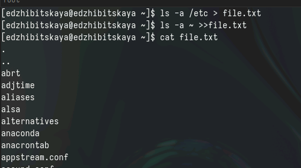
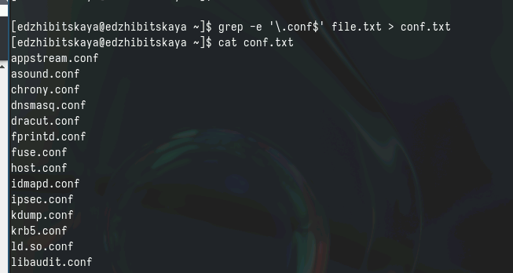
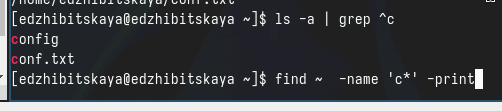
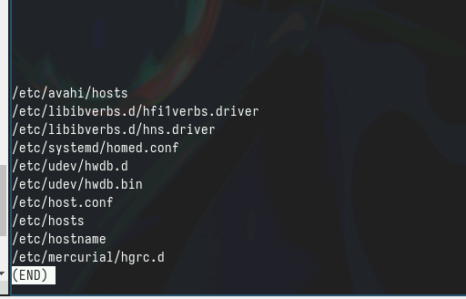
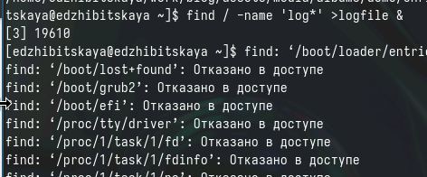
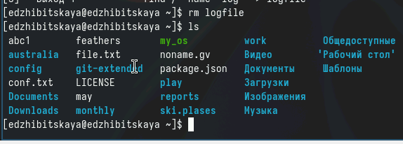
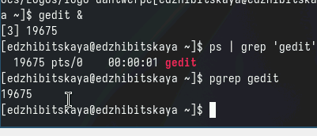
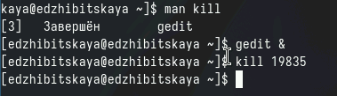
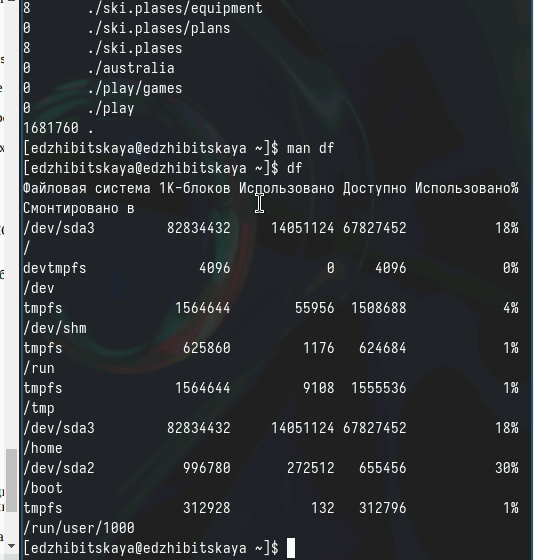
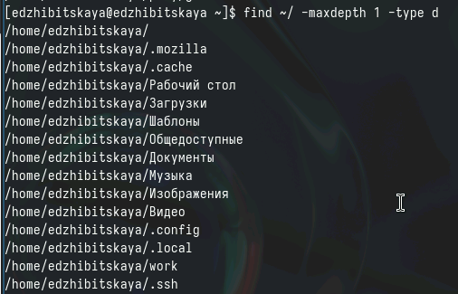

---
## Front matter
lang: ru-RU
title: Лабораторная работа № 8
subtitle: Поиск и фильтрация
author:
  - Жибицкая Евгения Дмитриевна
institute:
  - Российский университет дружбы народов, Москва, Россия
## i18n babel
babel-lang: russian
babel-otherlangs: english

## Formatting pdf
toc: false
toc-title: Содержание
slide_level: 2
aspectratio: 169
section-titles: true
theme: metropolis
header-includes:
 - \metroset{progressbar=frametitle,sectionpage=progressbar,numbering=fraction}
 - '\makeatletter'
 - '\beamer@ignorenonframefalse'
 - '\makeatother'
 
## Fonts
mainfont: PT Serif
romanfont: PT Serif
sansfont: PT Sans
monofont: PT Mono
mainfontoptions: Ligatures=TeX
romanfontoptions: Ligatures=TeX
sansfontoptions: Ligatures=TeX,Scale=MatchLowercase
monofontoptions: Scale=MatchLowercase,Scale=0.9
---

# Цель

## Цель

Знакомство с инструментами поиска текста и его фильтрации. Приобретение навыков по работе с ними.

# Ход работы

## Шаг 1
:::::::::::::: {.columns align=center}
::: {.column width="45%"}

:::
::: {.column width="50%"}

Запишем в файл названия файлов содержащихся в каталоге /etc. Допишем туда названия файлов, содержащихся в вашем домашнем каталоге. Командой cat выведем содержимое 
:::
::::::::::::::

## Шаг 2
:::::::::::::: {.columns align=center}
::: {.column width="50%"}

:::
::::::::::::::

## Шаг 3
:::::::::::::: {.columns align=center}
::: {.column width="50%"}

:::
::::::::::::::

## Шаг 4
:::::::::::::: {.columns align=center}
::: {.column width="50%"}

Вывод имен файлов каталога /etc, начинающиеся с символа h 
:::
::: {.column width="45%"}

:::
::::::::::::::

## Шаг 5
:::::::::::::: {.columns align=center}
::: {.column width="45%"}

::: 
::::::::::::::

## Шаг 6
:::::::::::::: {.columns align=center}
::: {.column width="50%"}

 
::: 
::::::::::::::

## Шаг 7
:::::::::::::: {.columns align=center}
::: {.column width="50%"}

:::
::::::::::::::

## Шаг 8
:::::::::::::: {.columns align=center}
::: {.column width="50%"}

:::
::::::::::::::

## Шаг 9
:::::::::::::: {.columns align=center}
::: {.column width="50%"}

 
:::
::: {.column width="45%"}

- du - команда оценки занимаемого пространства
- df - команда демонстрации файловых систем с указанием размеров

:::
::::::::::::::

## Шаг 10
:::::::::::::: {.columns align=center}
::: {.column width="50%"}

:::
::::::::::::::

# Вывод

## Вывод

В ходе работы были приобретены навыки по поиску и фильтрации текста и не только.
