---
## Front matter
title: "Лабораторная работа №8"
subtitle: "Дисциплина: Операционные системы"
author: "Жибицкая Евгения Дмитриевна"

## Generic otions
lang: ru-RU
toc-title: "Содержание"

## Bibliography
bibliography: bib/cite.bib
csl: pandoc/csl/gost-r-7-0-5-2008-numeric.csl

## Pdf output format
toc: true # Table of contents
toc-depth: 2
lof: true # List of figures
lot: true # List of tables
fontsize: 12pt
linestretch: 1.5
papersize: a4
documentclass: scrreprt
## I18n polyglossia
polyglossia-lang:
  name: russian
  options:
	- spelling=modern
	- babelshorthands=true
polyglossia-otherlangs:
  name: english
## I18n babel
babel-lang: russian
babel-otherlangs: english
## Fonts
mainfont: PT Serif
romanfont: PT Serif
sansfont: PT Sans
monofont: PT Mono
mainfontoptions: Ligatures=TeX
romanfontoptions: Ligatures=TeX
sansfontoptions: Ligatures=TeX,Scale=MatchLowercase
monofontoptions: Scale=MatchLowercase,Scale=0.9
## Biblatex
biblatex: true
biblio-style: "gost-numeric"
biblatexoptions:
  - parentracker=true
  - backend=biber
  - hyperref=auto
  - language=auto
  - autolang=other*
  - citestyle=gost-numeric
## Pandoc-crossref LaTeX customization
figureTitle: "Рис."
tableTitle: "Таблица"
listingTitle: "Листинг"
lofTitle: "Список иллюстраций"
lotTitle: "Список таблиц"
lolTitle: "Листинги"
## Misc options
indent: true
header-includes:
  - \usepackage{indentfirst}
  - \usepackage{float} # keep figures where there are in the text
  - \floatplacement{figure}{H} # keep figures where there are in the text
---

# Цель работы

Знакомство с инструментами поиска текста и его фильтрации. Приобретение навыков по работе с ними.

# Задание

1. Запишите в файл file.txt названия файлов, содержащихся в каталоге /etc. Допишите в этот же файл названия файлов, содержащихся в вашем домашнем каталоге.
2. Выведите имена всех файлов из file.txt, имеющих расширение .conf, после чего
запишите их в новый текстовой файл conf.txt.
Кулябов Д. С. и др. Операционные системы 59
3. Определите, какие файлы в вашем домашнем каталоге имеют имена, начинавшиеся
с символа c? Предложите несколько вариантов, как это сделать.
4. Выведите на экран (по странично) имена файлов из каталога /etc, начинающиеся
с символа h.
5. Запустите в фоновом режиме процесс, который будет записывать в файл ~/logfile
файлы, имена которых начинаются с log.
6. Удалите файл ~/logfile.
7. Запустите из консоли в фоновом режиме редактор gedit.
8. Определите идентификатор процесса gedit, используя команду ps, конвейер и фильтр
grep. Как ещё можно определить идентификатор процесса?
9. Прочтите справку (man) команды kill, после чего используйте её для завершения
процесса gedit.
10. Выполните команды df и du, предварительно получив более подробную информацию
об этих командах, с помощью команды man.
11. Воспользовавшись справкой команды find, выведите имена всех директорий, имеющихся в вашем домашнем каталоге.

# Выполнение лабораторной работы

1. Выполним вход в систему и запишем в файл названия файлов содержащихся в каталоге /etc. Допишим туда названия файлов, содержащихся в вашем домашнем каталоге. Командой cat выведем содержимое (рис. [-@fig:001]).

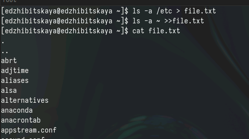{#fig:001 width=70%}

2. Запишем все имена из предыдущего файла имеющие расширение conf в новый файл,  также выведем содержимое командой cat (рис. [-@fig:002]).

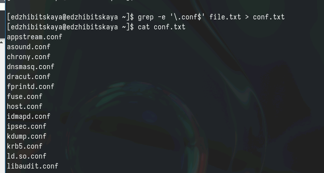{#fig:002 width=70%}

3. Затем определим какие файлы домашнего каталога начинаются на с(это можно сделать 2 способами) (рис. [-@fig:003]).

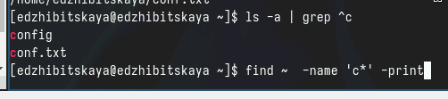{#fig:003 width=70%}

4. Выведем постранично имена файлов каталога /etc, начинающиеся с символа h (рис. [-@fig:004]) и (рис. [-@fig:005]).

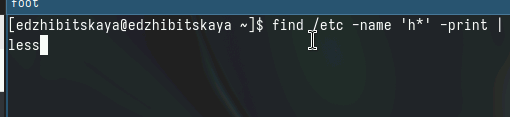{#fig:004 width=70%}

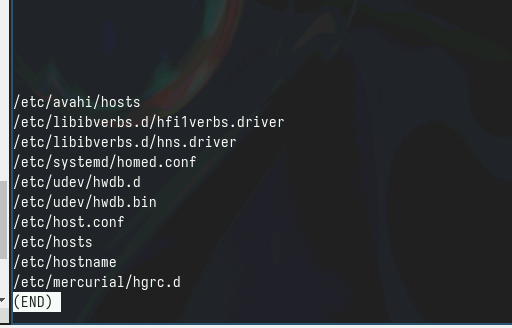{#fig:005 width=70%}

5. Потом запустим в фоновом режиме запись в  ~/logfile файлы, имена которых начинаются с log (рис. [-@fig:006]).

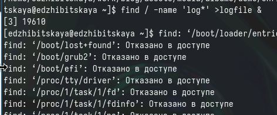{#fig:006 width=70%}

6.  Удалим этот же файл и убедимся, что он удалился (рис. [-@fig:007]).

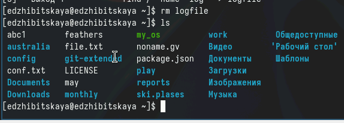{#fig:007 width=70%}

7. Следующим шагом запустим в консоли в фоновом режиме текстовый редактор (рис. [-@fig:008]).
Сразу же определим идентификатор процесса(2 разными способами).

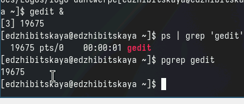{#fig:008 width=70%}

8. Ознакомившись с командой kill завершим процесс (рис. [-@fig:009]).

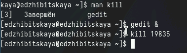{#fig:009 width=70%}

9. Также ознакомимся с командами df и du, запустим их (рис. [-@fig:010]).

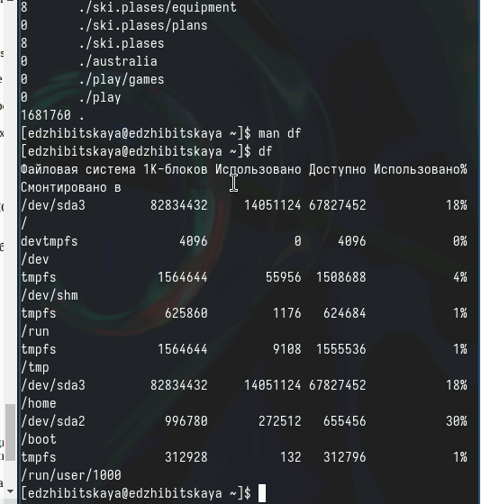{#fig:010 width=70%}

10. Последним шагом будет ознакомление с командой find и вывод имен всех каталогов домашней директории(рис. [-@fig:011]).

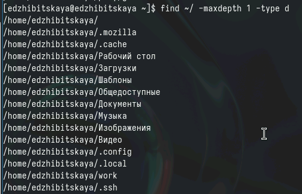{#fig:011 width=70%}

# Выводы

В ходе работы были приобретены навыки по поиску и фильтрации текста и не только.

# Список литературы{.unnumbered}
  
[ТУИС](https://esystem.rudn.ru/pluginfile.php/2288275/mod_resource/content/4/006-lab_proc.pdf) 
