---
## Front matter
lang: ru-RU
title: Лабораторная работа № 9
subtitle: Командная оболочка Midnight Commander
author:
  - Жибицкая Евгения Дмитриевна
institute:
  - Российский университет дружбы народов, Москва, Россия
## i18n babel
babel-lang: russian
babel-otherlangs: english

## Formatting pdf
toc: false
toc-title: Содержание
slide_level: 2
aspectratio: 169
section-titles: true
theme: metropolis
header-includes:
 - \metroset{progressbar=frametitle,sectionpage=progressbar,numbering=fraction}
 - '\makeatletter'
 - '\beamer@ignorenonframefalse'
 - '\makeatother'
 
## Fonts
mainfont: PT Serif
romanfont: PT Serif
sansfont: PT Sans
monofont: PT Mono
mainfontoptions: Ligatures=TeX
romanfontoptions: Ligatures=TeX
sansfontoptions: Ligatures=TeX,Scale=MatchLowercase
monofontoptions: Scale=MatchLowercase,Scale=0.9
---

# Цель

## Цель

Знакомство с командной оболочкой Midnight commander, приобретение навков по работе с файлами и каталогами с ее помощью.

# Ход работы

## Знакомство с оболочкой mc
:::::::::::::: {.columns align=center}
::: {.column width="45%"}

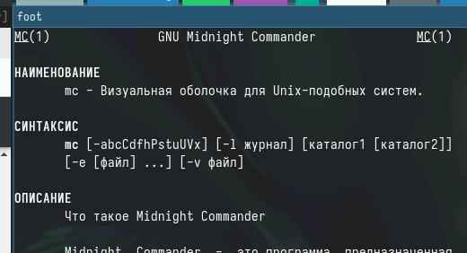
:::
::: {.column width="40%"}

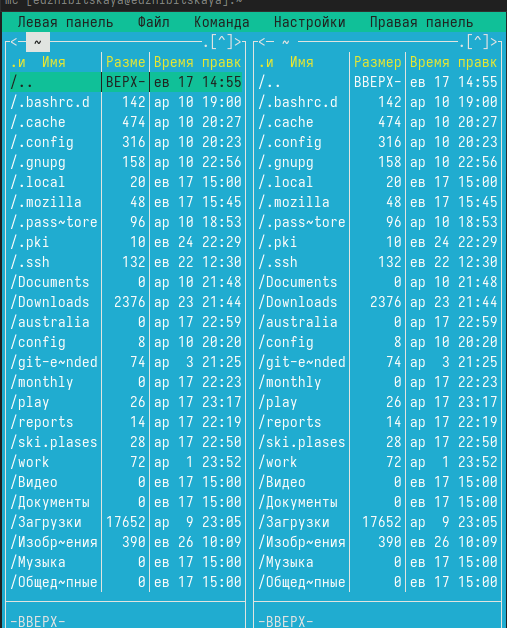
:::
::::::::::::::

## Знакомство с операциями
:::::::::::::: {.columns align=center}
::: {.column width="45%"}

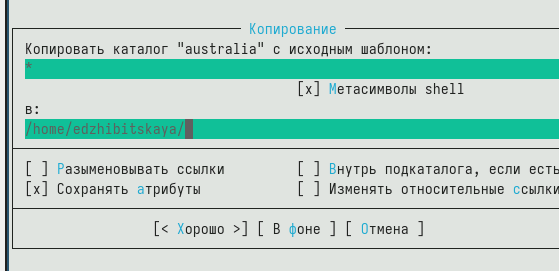
:::
::: {.column width="45%"}

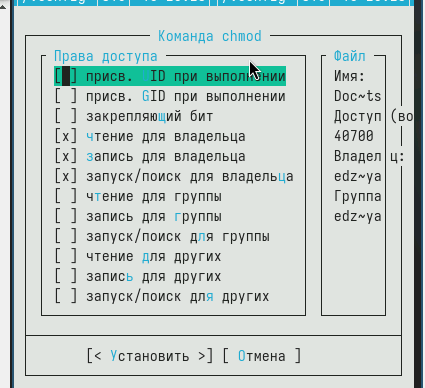
:::
::::::::::::::

## Панели
:::::::::::::: {.columns align=center}
::: {.column width="50%"}

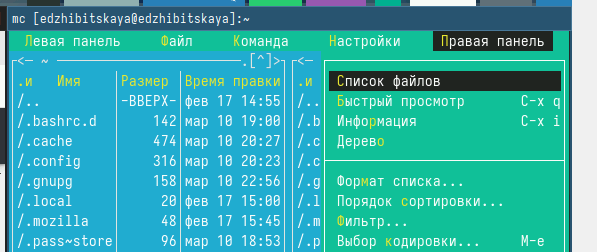
:::
::::::::::::::

## Подменю "файл"
:::::::::::::: {.columns align=center}
::: {.column width="50%"}

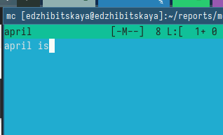
:::
::: {.column width="45%"}

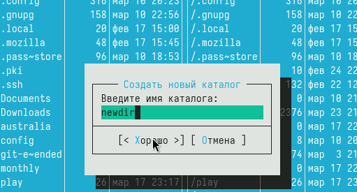

:::
::::::::::::::

## Подменю "команда"
:::::::::::::: {.columns align=center}
::: {.column width="45%"}

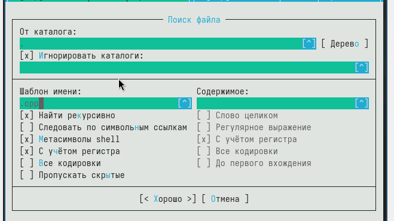
::: 
::::::::::::::

## Подменю "настройки"
:::::::::::::: {.columns align=center}
::: {.column width="50%"}

 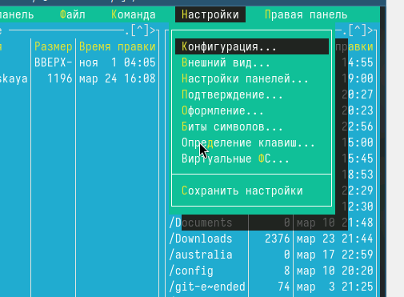
::: 
::::::::::::::

## Файл text 
:::::::::::::: {.columns align=center}
::: {.column width="50%"}

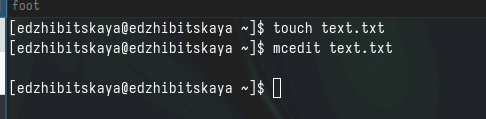

:::
::::::::::::::

## Работа с файлом
:::::::::::::: {.columns align=center}
::: {.column width="45%"}

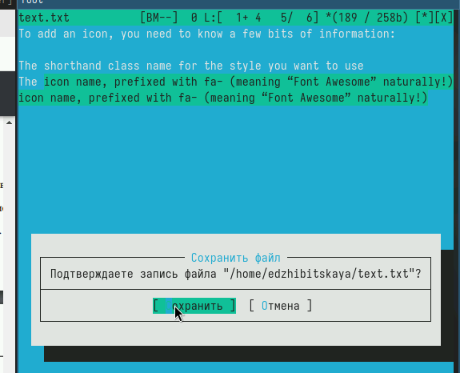

:::
::::::::::::::

## Работа с файлом с кодом программы
:::::::::::::: {.columns align=center}
::: {.column width="50%"}

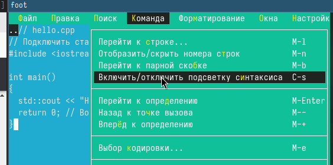 
:::
::::::::::::::

# Вывод

## Вывод

В ходе работы были приобретены навыки по работе с командной оболочкой Midnight Commander.

