---
## Front matter
title: "Лабораторная работа №9"
subtitle: "Дисциплина: Операционные системы"
author: "Жибицкая Евгения Дмитриевна"

## Generic otions
lang: ru-RU
toc-title: "Содержание"

## Bibliography
bibliography: bib/cite.bib
csl: pandoc/csl/gost-r-7-0-5-2008-numeric.csl

## Pdf output format
toc: true # Table of contents
toc-depth: 2
lof: true # List of figures
lot: true # List of tables
fontsize: 12pt
linestretch: 1.5
papersize: a4
documentclass: scrreprt
## I18n polyglossia
polyglossia-lang:
  name: russian
  options:
	- spelling=modern
	- babelshorthands=true
polyglossia-otherlangs:
  name: english
## I18n babel
babel-lang: russian
babel-otherlangs: english
## Fonts
mainfont: PT Serif
romanfont: PT Serif
sansfont: PT Sans
monofont: PT Mono
mainfontoptions: Ligatures=TeX
romanfontoptions: Ligatures=TeX
sansfontoptions: Ligatures=TeX,Scale=MatchLowercase
monofontoptions: Scale=MatchLowercase,Scale=0.9
## Biblatex
biblatex: true
biblio-style: "gost-numeric"
biblatexoptions:
  - parentracker=true
  - backend=biber
  - hyperref=auto
  - language=auto
  - autolang=other*
  - citestyle=gost-numeric
## Pandoc-crossref LaTeX customization
figureTitle: "Рис."
tableTitle: "Таблица"
listingTitle: "Листинг"
lofTitle: "Список иллюстраций"
lotTitle: "Список таблиц"
lolTitle: "Листинги"
## Misc options
indent: true
header-includes:
  - \usepackage{indentfirst}
  - \usepackage{float} # keep figures where there are in the text
  - \floatplacement{figure}{H} # keep figures where there are in the text
---

# Цель работы

Знакомство с командной оболочкой Midnight commander, приобретение навков по работе с файлами и каталогами с ее помощью.

# Выполнение лабораторной работы

Для начала ознакомимся с оболочкой, с помощью команды man (рис. [-@fig:001]).

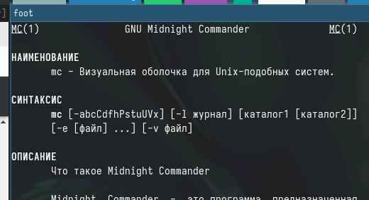{#fig:001 width=70%}

Затем запустим ее, изучим ее содержимое(рис. [-@fig:002]).

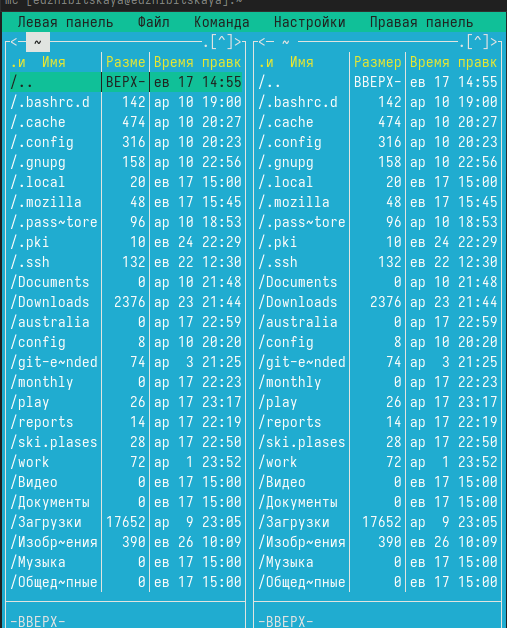{#fig:002 width=70%}

Выполним несколько основных операций(копирование и просмотр информации о правах доступа)(рис. [-@fig:003]) и (рис. [-@fig:004]).

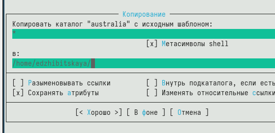{#fig:003 width=70%}

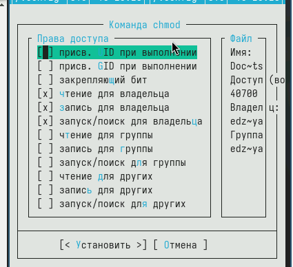{#fig:004 width=70%}

Также ознакомимся с командами панелей (рис. [-@fig:005]).

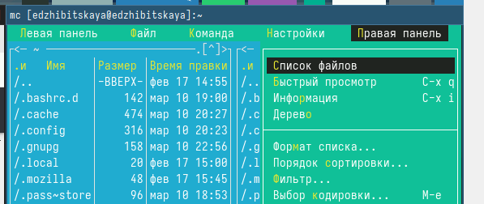{#fig:005 width=70%}

Используя подменю "файл", просмотрим содержимое файла, отредактируем его, создадим каталог и копируем туда файл (рис. [-@fig:006]), (рис. [-@fig:007]), (рис. [-@fig:008]), (рис. [-@fig:009]).

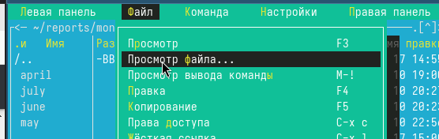{#fig:006 width=70%}

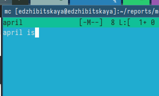{#fig:007 width=70%}

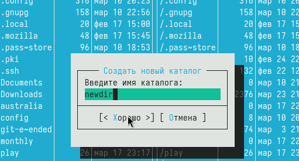{#fig:008 width=70%}

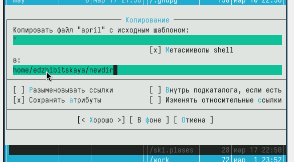{#fig:009 width=70%}

Используюя подменю "команда", осуществим поиск файлов с конкретным условием(рис. [-@fig:010]), ознакомимся с history(рис. [-@fig:011]), перейдем в домашний каталог и проанализируем файлы меню и расширений(рис. [-@fig:012]) и (рис. [-@fig:013]).

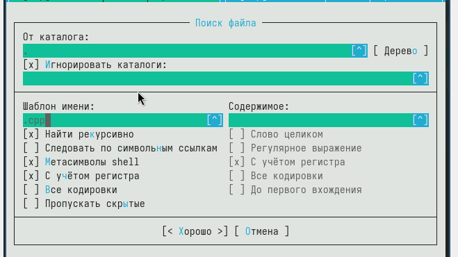{#fig:010 width=70%}

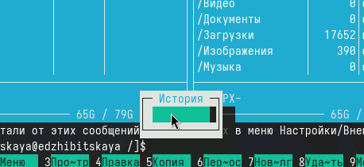{#fig:011 width=70%}

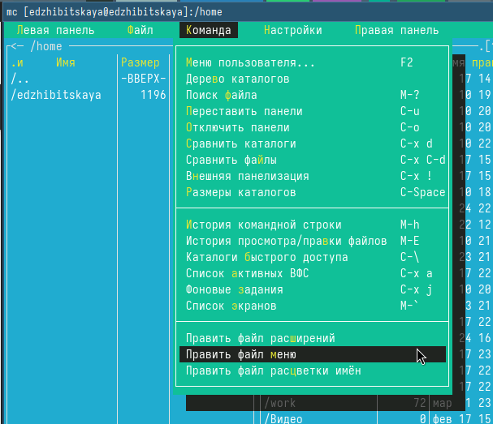{#fig:012 width=70%}

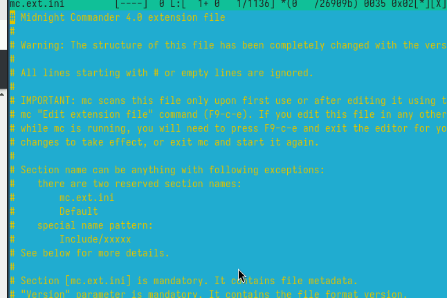{#fig:013 width=70%}

Используя подменю "настройки",  освоим  операции, отвечающие за структуру экрана (рис. [-@fig:014]).

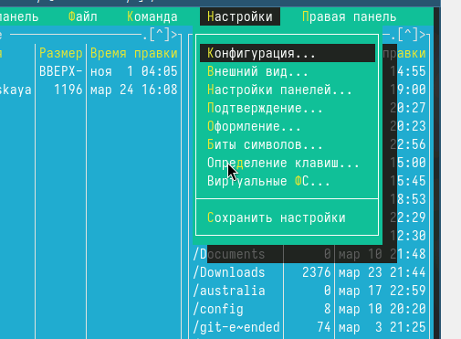{#fig:014 width=70%}

После выполнения всех этих действий, приступим к выполнению задания.

Для начала создадим файл и откроем его в текстовом встроенном редакторе(рис. [-@fig:015]).

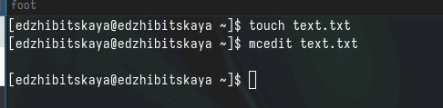{#fig:015 width=70%}

Вставим в него скопированный из интернета фрагмент (рис. [-@fig:016]).

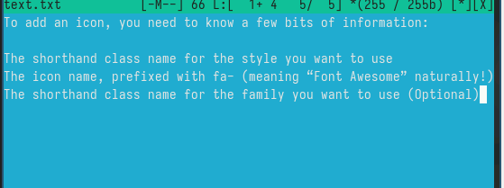{#fig:016 width=70%}

Далее удалим строку из файла, скопируем и перенесем фрагмент текста на новую строку(испозуем горячие клавиши), сохраним файл (рис. [-@fig:017]).

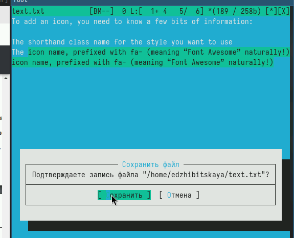{#fig:017 width=70%}

Отменим последнее действие, совершим еще несколько манипуляций, сохраним и закроем файл (рис. [-@fig:018]).

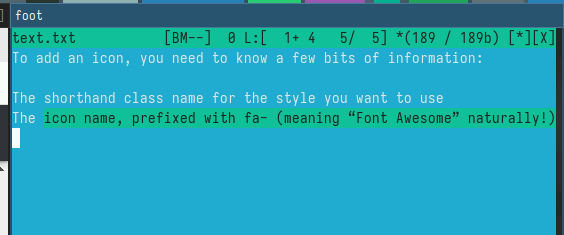{#fig:018 width=70%}

Далее создадим файл с расширением .cpp, вставим туда код программы и с помощью меню редактора отключим подсветку синтаксиса (рис. [-@fig:019]).

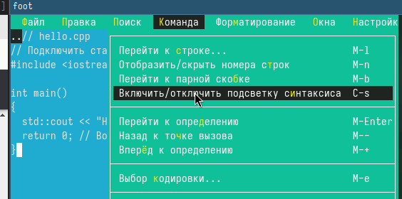{#fig:019 width=70%}

# Выводы

В ходе работы были приобретены навыки по работе с командной оболочкой Midnight Commander.

# Список литературы{.unnumbered}

[Туис](https://esystem.rudn.ru/pluginfile.php/2288277/mod_resource/content/5/007-lab_mc.pdf)

