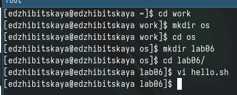
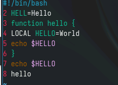
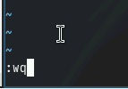
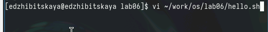
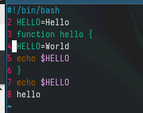
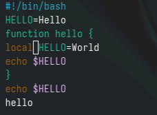
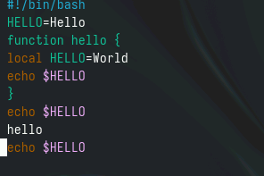
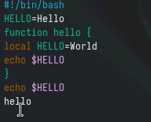
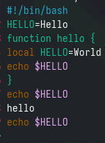

---
## Front matter
lang: ru-RU
title: Лабораторная работа №10
subtitle: vi редактор
author:
  - Жибицкая Евгения Дмитриевна
institute:
  - Российский университет дружбы народов, Москва, Россия
## i18n babel
babel-lang: russian
babel-otherlangs: english

## Formatting pdf
toc: false
toc-title: Содержание
slide_level: 2
aspectratio: 169
section-titles: true
theme: metropolis
header-includes:
 - \metroset{progressbar=frametitle,sectionpage=progressbar,numbering=fraction}
 - '\makeatletter'
 - '\beamer@ignorenonframefalse'
 - '\makeatother'
 
## Fonts
mainfont: PT Serif
romanfont: PT Serif
sansfont: PT Sans
monofont: PT Mono
mainfontoptions: Ligatures=TeX
romanfontoptions: Ligatures=TeX
sansfontoptions: Ligatures=TeX,Scale=MatchLowercase
monofontoptions: Scale=MatchLowercase,Scale=0.9
---

# Цель

## Цель 

Продолжение знакомства с операционной системой, знакомство с vi редактором.

# Ход работы

## 1 задание. Создание файла с помощью vi

:::::::::::::: {.columns align=center}
::: {.column width="45%"}

:::
::: {.column width="50%"}

:::
::::::::::::::

## Cохранение изменений и наделения правами
:::::::::::::: {.columns align=center}
::: {.column width="50%"}

:::
::: {.column width="50%"}
Командой chmod +x hello.sh сделаем файл исполняемым
:::
::::::::::::::

## Задание 2. Редактирование

:::::::::::::: {.columns align=center}
::: {.column width="70%"}

Вызов  vi на редактирование
:::
::::::::::::::

## Правка и удаление слов

:::::::::::::: {.columns align=center}
::: {.column width="50%"}

:::
::: {.column width="50%"}

:::
::::::::::::::

## Работа со строками

:::::::::::::: {.columns align=center}
::: {.column width="50%"}

:::
::: {.column width="50%"}

:::
::::::::::::::

## Отмена действия и выход

:::::::::::::: {.columns align=center}
::: {.column width="50%"}

:::
::::::::::::::

# Вывод

## Вывод

В ходе работы было произведено знакомство с редактором vi, создан и отредактирован с его помощью файл.

