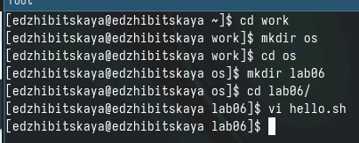
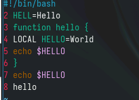
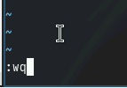
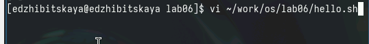
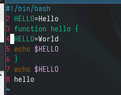
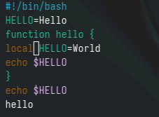
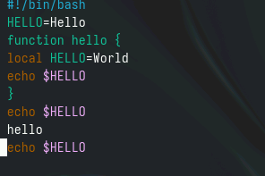
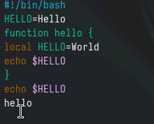
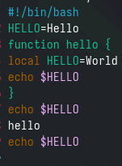

---
## Front matter
title: "Лабораторная работа №10"
subtitle: "Дисциплина: Операционные системы"
author: "Жибицкая Евгения Дмитриевна"

## Generic otions
lang: ru-RU
toc-title: "Содержание"

## Bibliography
bibliography: bib/cite.bib
csl: pandoc/csl/gost-r-7-0-5-2008-numeric.csl

## Pdf output format
toc: true # Table of contents
toc-depth: 2
lof: true # List of figures
lot: true # List of tables
fontsize: 12pt
linestretch: 1.5
papersize: a4
documentclass: scrreprt
## I18n polyglossia
polyglossia-lang:
  name: russian
  options:
	- spelling=modern
	- babelshorthands=true
polyglossia-otherlangs:
  name: english
## I18n babel
babel-lang: russian
babel-otherlangs: english
## Fonts
mainfont: PT Serif
romanfont: PT Serif
sansfont: PT Sans
monofont: PT Mono
mainfontoptions: Ligatures=TeX
romanfontoptions: Ligatures=TeX
sansfontoptions: Ligatures=TeX,Scale=MatchLowercase
monofontoptions: Scale=MatchLowercase,Scale=0.9
## Biblatex
biblatex: true
biblio-style: "gost-numeric"
biblatexoptions:
  - parentracker=true
  - backend=biber
  - hyperref=auto
  - language=auto
  - autolang=other*
  - citestyle=gost-numeric
## Pandoc-crossref LaTeX customization
figureTitle: "Рис."
tableTitle: "Таблица"
listingTitle: "Листинг"
lofTitle: "Список иллюстраций"
lotTitle: "Список таблиц"
lolTitle: "Листинги"
## Misc options
indent: true
header-includes:
  - \usepackage{indentfirst}
  - \usepackage{float} # keep figures where there are in the text
  - \floatplacement{figure}{H} # keep figures where there are in the text
---

# Цель работы

Продолжение знакомства с операционной системой, знакомство с vi редактором.

# Выполнение лабораторной работы

* Задание 1. Создание  файла с использованием vi

Для начала создадим каталог os/lab06, перейдем в него и, вызвав vi, создадим файл (рис. [-@fig:001]).

{#fig:001 width=70%}

Затем с помощью i перейдем в режим правки и вставим предложенный текст(рис. [-@fig:002]).

{#fig:002 width=70%}

Использовав :wq внизу экрана запишем(сохраним) изменения и, нажав enter, завершим работу (рис. [-@fig:003]).

{#fig:003 width=70%}

Кроме того, командой chmod +x hello.sh сделаем файл исполняемым.

* Задание 2. Редактирование файла

Вызовем редактор vi на редактирование(рис. [-@fig:004]).

{#fig:004 width=70%}

Установим курсор в конец HELL второй строчки и заменим его на HELLO(c помощью режима правки), вернемся в командный режим (рис. [-@fig:005]).

{#fig:005 width=70%}

Далее сотрем слово LOCAL в четвертой строке(с помощью х) и введем local. Вернемся в командный режим (рис. [-@fig:006]).

{#fig:006 width=70%}

Установим курсор на последней строке и вставим в конец документа предпоследнюю строку (рис. [-@fig:007]).

{#fig:007 width=70%}

Выйдем из режима правки. Удалим добавленную строку, нажав dd(рис. [-@fig:008]).

{#fig:008 width=70%}

Наконец, командой u отменим последнее действие, а с помощью : и wq заверщим работу, сохранив изменения(рис. [-@fig:009]).

{#fig:009 width=70%}

# Ответы на контрольные вопросы

1. Режимы работы редактора vi включают в себя командный режим, режим вставки и режим последней строки. Командный режим используется для перемещения по тексту и выполнения команд, режим вставки - для ввода и редактирования текста, режим последней строки - для выполнения команд над всем файлом.

2. Для выхода из редактора vi без сохранения произведенных изменений необходимо выполнить команду ":q!".

3. Команды позиционирования включают в себя h (влево), j (вниз), k (вверх), l (вправо), ^ (в начало строки), $ (в конец строки), 0 (в начало строки), G (в конец файла).

4. Для редактора vi словом является последовательность символов, разделенных пробелами или другими символами пунктуации.

5. Для перемещения в начало файла необходимо нажать клавишу gg, а для перемещения в конец - клавишу G.

6. Основные группы команд редактирования включают в себя команды удаления, копирования, вставки, замены, отмены действий и т.д.

7. Для заполнения строки символами $ необходимо нажать клавишу R и ввести нужное количество символов.

8. Некорректное действие, связанное с процессом редактирования, можно отменить, нажав клавишу u для отмены последнего действия.

9. Основные группы команд режима последней строки включают в себя команды сохранения изменений в файле, выхода из редактора, выполнения поиска и замены и т.д.

10. Для определения позиции, в которой заканчивается строка, не перемещая курсора, можно нажать клавишу $.

11. Для анализа опций редактора vi можно использовать команду ":set", которая показывает текущие настройки и опции редактора.

12. Режим работы редактора vi можно определить по символу внизу экрана: в командном режиме отображается символ ":", в режиме вставки - "INSERT", в режиме последней строки - ":".

# Выводы

В ходе работы было произведено знакомство с редактором vi, создан и отредактирован с его помощью файл.

