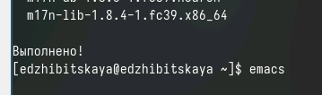
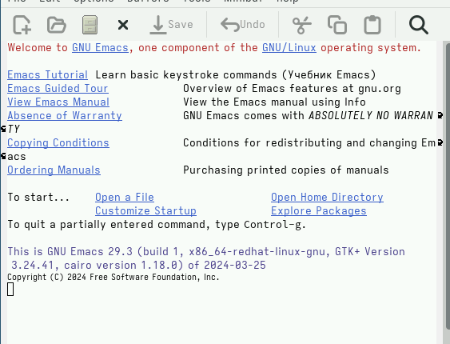
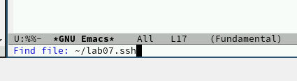
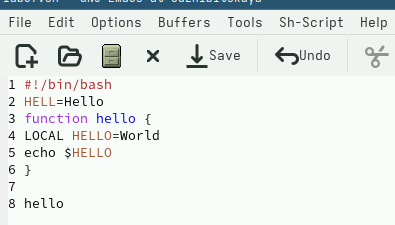
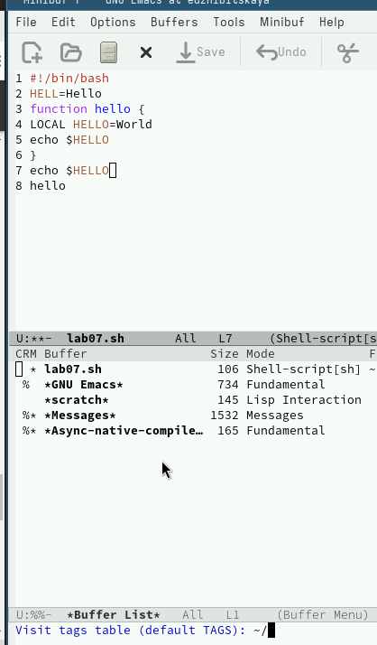
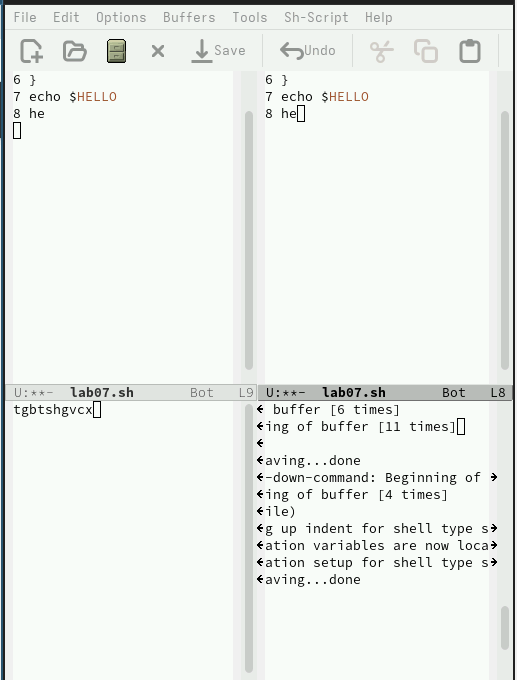
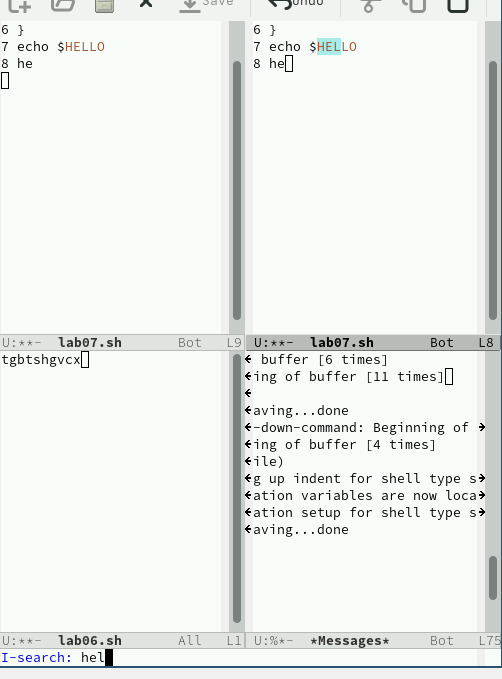
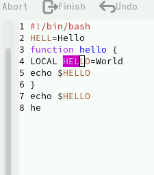

---
## Front matter
lang: ru-RU
title: Лабораторная работа №11
subtitle: Emacs редактор
author:
  - Жибицкая Евгения Дмитриевна
institute:
  - Российский университет дружбы народов, Москва, Россия
## i18n babel
babel-lang: russian
babel-otherlangs: english

## Formatting pdf
toc: false
toc-title: Содержание
slide_level: 2
aspectratio: 169
section-titles: true
theme: metropolis
header-includes:
 - \metroset{progressbar=frametitle,sectionpage=progressbar,numbering=fraction}
 - '\makeatletter'
 - '\beamer@ignorenonframefalse'
 - '\makeatother'
 
## Fonts
mainfont: PT Serif
romanfont: PT Serif
sansfont: PT Sans
monofont: PT Mono
mainfontoptions: Ligatures=TeX
romanfontoptions: Ligatures=TeX
sansfontoptions: Ligatures=TeX,Scale=MatchLowercase
monofontoptions: Scale=MatchLowercase,Scale=0.9
---

# Цель

## Цель 

Знакомство с редактором Emacs, приобретение навыков по работе с ним.

# Ход работы

## Подготовка к работе

:::::::::::::: {.columns align=center}
::: {.column width="45%"}

:::
::: {.column width="50%"}

:::
::::::::::::::

## Начало работы
:::::::::::::: {.columns align=center}
::: {.column width="50%"}

Создание файла с помощью C-x C-f 
:::
::: {.column width="50%"}

:::
::::::::::::::

## Работа с текстом

:::::::::::::: {.columns align=center}
::: {.column width="50%"}

:::
::: {.column width="50%"}

- C-k - вырезание строки
- C-y - вставка строки
- C-space - выделение области
- A-w - копирование в буфер и затем вставка в конец строки 
- C-/ - отмена действия

:::
::::::::::::::

## Копирование текста в буфер и работа с курсором
:::::::::::::: {.columns align=center}
::: {.column width="50%"}

:::
::: {.column width="50%"}

- C-a - перемещение в начало строки
- С-e - перемещение в конец строки 
- A-< и A-> - перемещение по буферу

:::
::::::::::::::

## Работа с буфером

:::::::::::::: {.columns align=center}
::: {.column width="50%"}

C-x C-b выведем список активных буферов на экран

:::
::: {.column width="30%"}

:::
::::::::::::::

## Управление окнами

:::::::::::::: {.columns align=center}
::: {.column width="30%"}

:::
::::::::::::::

## Режимы поиска

:::::::::::::: {.columns align=center}
::: {.column width="30%"}

:::
::: {.column width="30%"}

:::
::::::::::::::

# Вывод

## Вывод

Ознакомились с редактором emacs, узнали о принципах его работы и приобрели практические навыки.

