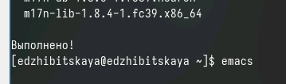
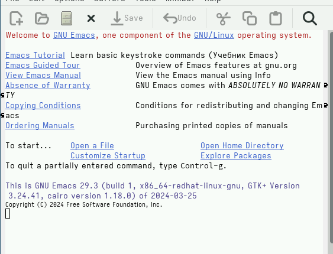
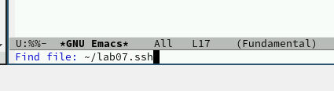
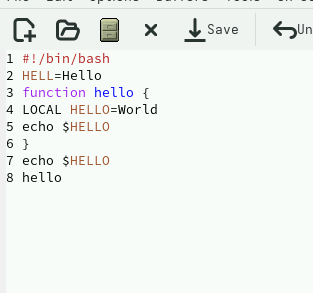
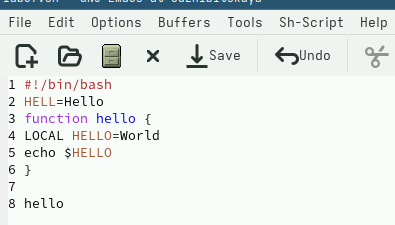
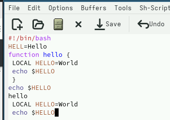
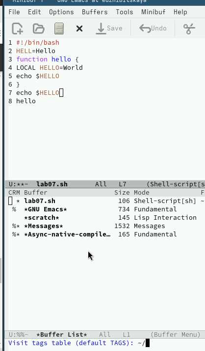
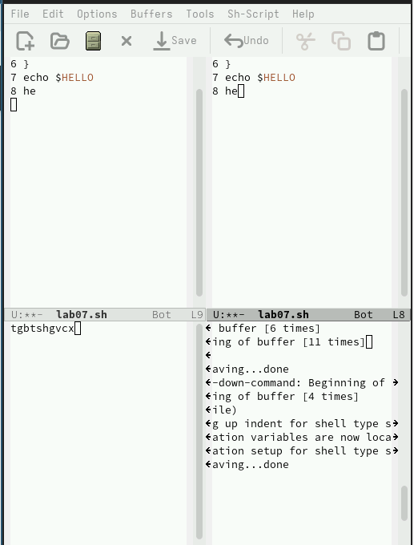
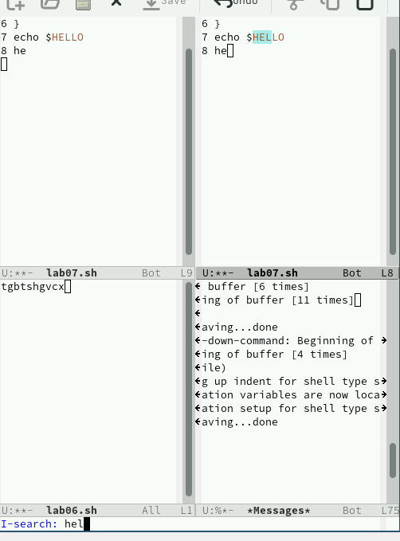
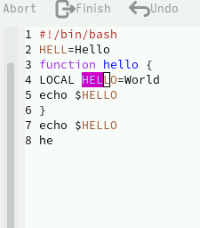

---
## Front matter
title: "Лабораторная работа №11"
subtitle: "Дисциплина: Операционные системы"
author: "Жибицкая Евгения Дмитриевна"

## Generic otions
lang: ru-RU
toc-title: "Содержание"

## Bibliography
bibliography: bib/cite.bib
csl: pandoc/csl/gost-r-7-0-5-2008-numeric.csl

## Pdf output format
toc: true # Table of contents
toc-depth: 2
lof: true # List of figures
lot: true # List of tables
fontsize: 12pt
linestretch: 1.5
papersize: a4
documentclass: scrreprt
## I18n polyglossia
polyglossia-lang:
  name: russian
  options:
	- spelling=modern
	- babelshorthands=true
polyglossia-otherlangs:
  name: english
## I18n babel
babel-lang: russian
babel-otherlangs: english
## Fonts
mainfont: PT Serif
romanfont: PT Serif
sansfont: PT Sans
monofont: PT Mono
mainfontoptions: Ligatures=TeX
romanfontoptions: Ligatures=TeX
sansfontoptions: Ligatures=TeX,Scale=MatchLowercase
monofontoptions: Scale=MatchLowercase,Scale=0.9
## Biblatex
biblatex: true
biblio-style: "gost-numeric"
biblatexoptions:
  - parentracker=true
  - backend=biber
  - hyperref=auto
  - language=auto
  - autolang=other*
  - citestyle=gost-numeric
## Pandoc-crossref LaTeX customization
figureTitle: "Рис."
tableTitle: "Таблица"
listingTitle: "Листинг"
lofTitle: "Список иллюстраций"
lotTitle: "Список таблиц"
lolTitle: "Листинги"
## Misc options
indent: true
header-includes:
  - \usepackage{indentfirst}
  - \usepackage{float} # keep figures where there are in the text
  - \floatplacement{figure}{H} # keep figures where there are in the text
---

# Цель работы

Знакомство с редактором Emacs, приобретение навыков по работе с ним.

# Задание

1. Ознакомиться с теоретическим материалом.
2. Ознакомиться с редактором emacs.
3. Выполнить упражнения.
 1. Открыть emacs.
 2. Создать файл lab07.sh с помощью комбинации Ctrl-x Ctrl-f (C-x C-f).
 3. Наберите текст
 4. Сохранить файл с помощью комбинации Ctrl-x Ctrl-s (C-x C-s).
 5. Проделать с текстом стандартные процедуры редактирования, каждое действие должно осуществляться комбинацией клавиш.
 6. Научитесь использовать команды по перемещению курсора.
 7. Управление буферами
 8. Управление окнами

4. Ответить на контрольные вопросы.

# Выполнение лабораторной работы

Для начала установим сам редактор и запустим его, написав emacs в терминале(рис. [-@fig:001]).

{#fig:001 width=70%}

Открыв редактор((рис. [-@fig:002]) и используя комбинации C-x C-f  создадим файл(рис. [-@fig:003])

{#fig:002 width=70%}

{#fig:003 width=70%}

Вставим в этот файл текст и сохраним его, нажав C-x C-s(рис. [-@fig:004])

{#fig:004 width=70%}

Далее проделаем следующие действия по работе с текстом:
- C-k - вырезание строки (рис. [-@fig:005])
- C-y - вставка строки
- C-space - выделение области
- A-w - копирование в буфер и затем вставка в конец строки (рис. [-@fig:006])
- C-/ - отмена действия

{#fig:005 width=70%}

{#fig:006 width=70%}

Произведем также некоторые действия по перемещению курсора
- C-a - перемещение в начало строки
- С-e - перемещение в конец строки (рис. [-@fig:011])
- A-< и A-> - перемещение по буферу

{#fig:011 width=70%}

Далее командами C-x C-b выведем список активных буферов на экран(рис. [-@fig:007]). Затем закроем окно сочетанием C-x 0.

{#fig:007 width=70%}

Перейдем к управлению окнами. В два этапа разделим фрейм на 4 окна(C-x 3 C-x 2), откроем там разные файлы и заполним текстом (рис. [-@fig:008]).

{#fig:008 width=70%}

И наконец изучим режим поиска. Переключимся на него С-s и произведем поиск слов. Выход осуществим командой C-g(рис. [-@fig:009]).

{#fig:009 width=70%}

Также режим поиска можно осуществлять вместе с заменой, используя A-%, eenter и !.

Еще один режим поиска - M-s o (рис. [-@fig:010])

{#fig:010 width=70%}

# Выводы

Ознакомились с редактором emacs, узнали о принципах его работы и приобрели практические навыки.

# Список литературы{.unnumbered}

[ТУИС](https://esystem.rudn.ru/pluginfile.php/2288281/mod_resource/content/5/009-lab_emacs.pdf)

