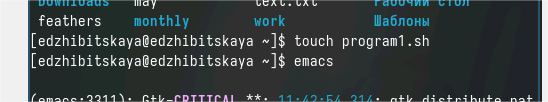
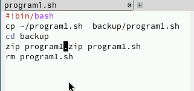
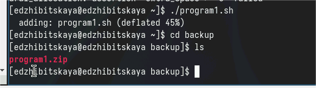
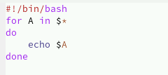
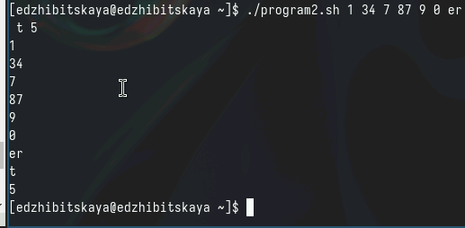
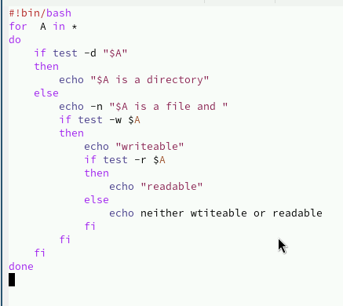
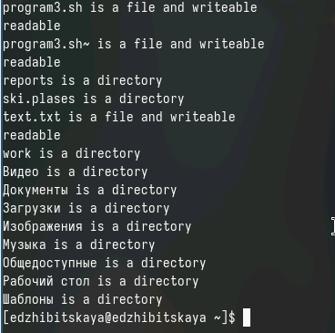
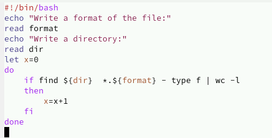
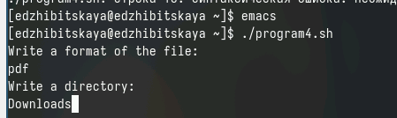

---
## Front matter
lang: ru-RU
title: Лабораторная работа №12
subtitle: Программирование в командном процессоре ОС UNIX. Командные файлы
author:
  - Жибицкая Евгения Дмитриевна
institute:
  - Российский университет дружбы народов, Москва, Россия
## i18n babel
babel-lang: russian
babel-otherlangs: english

## Formatting pdf
toc: false
toc-title: Содержание
slide_level: 2
aspectratio: 169
section-titles: true
theme: metropolis
header-includes:
 - \metroset{progressbar=frametitle,sectionpage=progressbar,numbering=fraction}
 - '\makeatletter'
 - '\beamer@ignorenonframefalse'
 - '\makeatother'
 
## Fonts
mainfont: PT Serif
romanfont: PT Serif
sansfont: PT Sans
monofont: PT Mono
mainfontoptions: Ligatures=TeX
romanfontoptions: Ligatures=TeX
sansfontoptions: Ligatures=TeX,Scale=MatchLowercase
monofontoptions: Scale=MatchLowercase,Scale=0.9
---

# Цель

## Цель 

Изучение основ программирования в оболочке ОС UNIX. Написание небольших программ.

# Ход работы

## Подготовка к работе

:::::::::::::: {.columns align=center}
::: {.column width="45%"}

:::
::: {.column width="50%"}

Перед написанием программы создаем файл, наделяем его правами chmod u+x или +x, открываем редактор
:::
::::::::::::::

## Программа 1
:::::::::::::: {.columns align=center}
::: {.column width="50%"}

:::
::: {.column width="50%"}

:::
::::::::::::::

## Программа 2

:::::::::::::: {.columns align=center}
::: {.column width="50%"}

:::
::: {.column width="50%"}

:::
::::::::::::::

## Программа 3
:::::::::::::: {.columns align=center}
::: {.column width="50%"}

:::
::: {.column width="50%"}

:::
::::::::::::::

## Программа 4

:::::::::::::: {.columns align=center}
::: {.column width="50%"}

:::
::: {.column width="30%"}

]

:::
::::::::::::::

# Вывод

## Вывод

В ходе работы мы познакомились с различным командами и особенностями программирования в оболочке UNIX,  освоили написание небольших скриптов.

