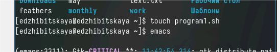
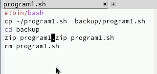
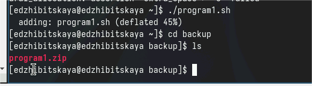
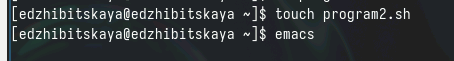
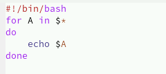
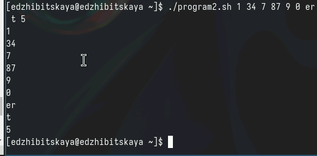
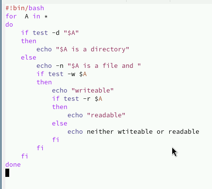
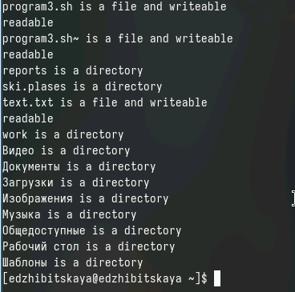
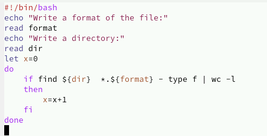
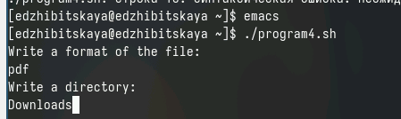

---
## Front matter
title: "Лабораторная работа №12"
subtitle: "Дисциплина: Операционные системы"
author: "Жибицкая Евгения Дмитриевна"

## Generic otions
lang: ru-RU
toc-title: "Содержание"

## Bibliography
bibliography: bib/cite.bib
csl: pandoc/csl/gost-r-7-0-5-2008-numeric.csl

## Pdf output format
toc: true # Table of contents
toc-depth: 2
lof: true # List of figures
lot: true # List of tables
fontsize: 12pt
linestretch: 1.5
papersize: a4
documentclass: scrreprt
## I18n polyglossia
polyglossia-lang:
  name: russian
  options:
	- spelling=modern
	- babelshorthands=true
polyglossia-otherlangs:
  name: english
## I18n babel
babel-lang: russian
babel-otherlangs: english
## Fonts
mainfont: PT Serif
romanfont: PT Serif
sansfont: PT Sans
monofont: PT Mono
mainfontoptions: Ligatures=TeX
romanfontoptions: Ligatures=TeX
sansfontoptions: Ligatures=TeX,Scale=MatchLowercase
monofontoptions: Scale=MatchLowercase,Scale=0.9
## Biblatex
biblatex: true
biblio-style: "gost-numeric"
biblatexoptions:
  - parentracker=true
  - backend=biber
  - hyperref=auto
  - language=auto
  - autolang=other*
  - citestyle=gost-numeric
## Pandoc-crossref LaTeX customization
figureTitle: "Рис."
tableTitle: "Таблица"
listingTitle: "Листинг"
lofTitle: "Список иллюстраций"
lotTitle: "Список таблиц"
lolTitle: "Листинги"
## Misc options
indent: true
header-includes:
  - \usepackage{indentfirst}
  - \usepackage{float} # keep figures where there are in the text
  - \floatplacement{figure}{H} # keep figures where there are in the text
---

# Цель работы

Изучение основ программирования в оболочке ОС UNIX. Написание небольших программ.

# Задание

1. Написать скрипт, который при запуске будет делать резервную копию самого себя (то
есть файла, в котором содержится его исходный код) в другую директорию backup
в вашем домашнем каталоге. При этом файл должен архивироваться одним из архиваторов на выбор zip, bzip2 или tar. Способ использования команд архивации
необходимо узнать, изучив справку.
2. Написать пример командного файла, обрабатывающего любое произвольное число
аргументов командной строки, в том числе превышающее десять. Например, скрипт
может последовательно распечатывать значения всех переданных аргументов.
3. Написать командный файл — аналог команды ls (без использования самой этой команды и команды dir). Требуется, чтобы он выдавал информацию о нужном каталоге
и выводил информацию о возможностях доступа к файлам этого каталога.
4. Написать командный файл, который получает в качестве аргумента командной строки
формат файла (.txt, .doc, .jpg, .pdf и т.д.) и вычисляет количество таких файлов
в указанной директории. Путь к директории также передаётся в виде аргумента командной строки.

# Выполнение лабораторной работы

 Перед началом непосредственно написания скриптов изучим принципы работы, узнаем синтаксис и особенности такого вида программирования.
 
 Затем передем к написанию программ. Создадим директорию backup  для резервного копирования и файл program1.sh. Откроем его для редактирования(рис. [-@fig:001]).

{#fig:001 width=70%}

Напишем первую программу.
Копируем файл в нужный нам каталог, переходим в него, архивируем файл и удаляем ненужную версию (рис. [-@fig:002]).

{#fig:002 width=70%}

Дадим файлу право на исполнение(chmod +x) и соответстенно запустим его (рис. [-@fig:003]).

{#fig:003 width=70%}

Создадим файл для второй программы, запустим его в редакторе emacs (рис. [-@fig:004]).

{#fig:004 width=70%}

Напишем программу, получающую на вход различные данные и циклом выводящую их обратно на экран (рис. [-@fig:005]).

{#fig:005 width=70%} 

Запустим программу, предварительно дав ей право на исполнение (рис. [-@fig:006]).

{#fig:006 width=70%}

Перейдем к написанию скрипта 3. Также создадим файл, дадим его необходимые права и откроем в редакторе emacs. 

Запустим цикл, который с помощью ключей определяет тип файла(или каталога) и делает проверку на его права(чтение или редактирование) (рис. [-@fig:007]). 

Запустим файл, посмотрим на результат (рис. [-@fig:008]).

{#fig:007 width=70%}

{#fig:008 width=70%}

Перейдем к четвертому скрипту. Создадим файл, наделим его правами и откроем.
Напишем программу.  Здесь нам надо на вход получить название каталога и расширение, а затем пройтись по всем файлам и посчитать все, у которых такое же расширение  (рис. [-@fig:009]).

Запустим программу (рис. [-@fig:010]).

{#fig:009 width=70%}

{#fig:010 width=70%}

# Контрольные вопросы

1. Командная оболочка - это интерфейс командной строки, который позволяет пользователю работать с операционной системой путем ввода текстовых команд. Примеры командных оболочек: bash, zsh, sh, ksh. Они отличаются друг от друга своими возможностями и синтаксисом команд.

2. POSIX (Portable Operating System Interface) - это набор стандартов, разработанных IEEE,  определяющих интерфейсы для взаимодействия между операционной системой и прикладными программами.

3. Переменные в bash определяются путем присвоения им значения, например: 
variable=value

Массивы в bash определяются следующим образом:
array=(value1 value2 value3)

4. Оператор let используется для выполнения арифметических операций, а оператор read позволяет считывать данные с клавиатуры.

5. В bash можно применять арифметические операции такие как сложение, вычитание, умножение, деление, остаток от деления и т.д.

6. Операция (( )) используется для вычисления арифметических выражений в bash.

7. Некоторые стандартные имена переменных в bash: HOME, PATH, USER, SHELL, PWD и т.д.

8. Метасимволы - это символы, которые имеют специальное значение в командной оболочке, например "*", "?", "[", "$" и т.д.

9. Для экранирования метасимволов в bash используют обратный слэш "", например:  *.

10. Командные файлы создаются с помощью текстового редактора и сохраняются с расширением ".sh". Для их запуска необходимо установить права на выполнение с помощью команды chmod +x, а затем выполнить файл через команду ./название_файла.sh.

11. Функции в bash определяются следующим образом:
function_name() {
    команды
}

12. Для определения, является ли файл каталогом или обычным файлом, можно использовать команду test:

if [ -d file ]; then
    echo "Это каталог"
else
    echo "Это обычный файл"
fi

13. Команды set, typeset и unset используются для работы с переменными в bash. set устанавливает значения переменных среды, typeset определяет тип переменной и устанавливает ее свойства, unset удаляет переменные.

14. Параметры передаются в командные файлы как аргументы командной строки. Например, $1 - первый параметр, $2 - второй параметр и так далее.

15. Специальные переменные языка bash:
- $0 - название выполняемого файла
- $# - количество аргументов
- $@ - все аргументы в виде списка
- $$ - идентификатор текущего процесса
- $? - код завершения последней выполненной команды

# Выводы

В ходе работы мы познакомились с различным командами и особенностями программирования в оболочке UNIX,  освоили написание небольших скриптов.

