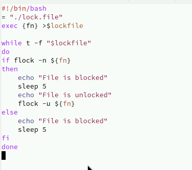
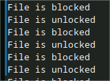
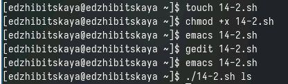
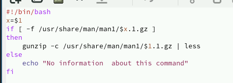
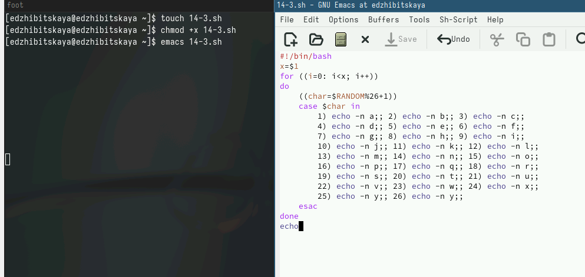
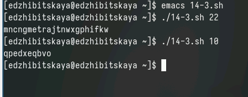

---
## Front matter
lang: ru-RU
title: Лабораторная работа №14
subtitle: Программирование в командном процессоре ОС UNIX. Расширенное программирование
author:
  - Жибицкая Евгения Дмитриевна
institute:
  - Российский университет дружбы народов, Москва, Россия
## i18n babel
babel-lang: russian
babel-otherlangs: english

## Formatting pdf
toc: false
toc-title: Содержание
slide_level: 2
aspectratio: 169
section-titles: true
theme: metropolis
header-includes:
 - \metroset{progressbar=frametitle,sectionpage=progressbar,numbering=fraction}
 - '\makeatletter'
 - '\beamer@ignorenonframefalse'
 - '\makeatother'
 
## Fonts
mainfont: PT Serif
romanfont: PT Serif
sansfont: PT Sans
monofont: PT Mono
mainfontoptions: Ligatures=TeX
romanfontoptions: Ligatures=TeX
sansfontoptions: Ligatures=TeX,Scale=MatchLowercase
monofontoptions: Scale=MatchLowercase,Scale=0.9
---

# Цель

## Цель 

Изучение основ программирования в оболочке ОС UNIX. Приобретение практических навыков в написании более сложных командных файлов с использованием логических управляющих конструкций и циклов.

# Ход работы

## Пункт 1. Задание

Написать командный файл, реализующий упрощённый механизм семафоров. Освобождения ресурса, выдавая об этом сообщение,  также выдавать информацию о том, что ресурс используется соответствующим командным файлом (процессом). Запустить командный файл в одном виртуальном терминале в фоновом режиме, перенаправив его вывод в другой (> /dev/tty#, где # — номер терминала куда перенаправляется вывод), в котором также запущен этот файл, но не фоновом, а в привилегированном режиме. Иметь возможность взаимодействия трёх и более процессов.

## Пункт 1

:::::::::::::: {.columns align=center}
::: {.column width="45%"}

:::
::: {.column width="40%"}

:::
::::::::::::::

## Пункт 1. Результат
:::::::::::::: {.columns align=center}
::: {.column width="50%"}

:::
::::::::::::::

## Пункт 2. Задание

 Реализовать команду man с помощью командного файла. Изучите содержимое каталога /usr/share/man/man1. В нем находятся архивы текстовых файлов, содержащих справку по большинству установленных в системе программ и команд. Каждый архив можно открыть командой less сразу же просмотрев содержимое справки. Командный файл должен получать в виде аргумента командной строки название команды и в виде результата выдавать справку об этой команде или сообщение об отсутствии справки, если соответствующего файла нет в каталоге man1.

## Пункт 2. 

:::::::::::::: {.columns align=center}
::: {.column width="50%"}

:::
::: {.column width="30%"}

:::
::::::::::::::

## Пункт 3. Задание 

 Используя встроенную переменную $RANDOM, напишите командный файл, генерирующий случайную последовательность букв латинского алфавита. Учтите, что $RANDOM выдаёт псевдослучайные числа в диапазоне от 0 до 32767.

## Пункт 3. Реализация
:::::::::::::: {.columns align=center}
::: {.column width="50%"}

:::
::: {.column width="30%"}

:::
::::::::::::::

# Вывод

## Вывод

В ходе работы было изучено программирование в оболочке ОС UNIX. Приобретены навыки в  написании более сложных командных файлов с использованием логических управляющих конструкций и циклов, а также реализовано 3 программы в данной оболочке.

