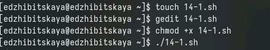
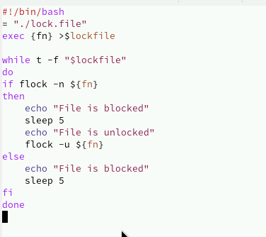
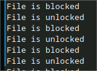
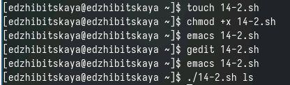
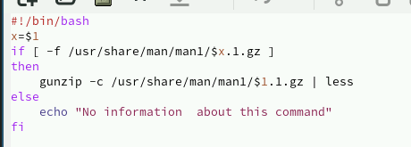
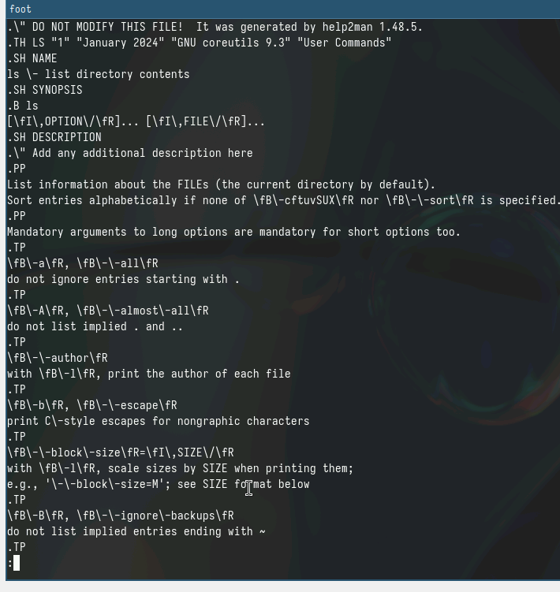
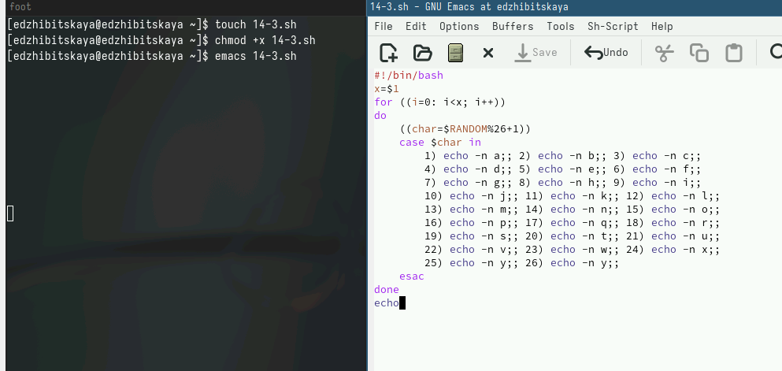
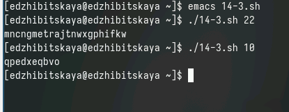

---
## Front matter
title: "Лабораторная работа №14"
subtitle: "Дисциплина: Операционные системы"
author: "Жибицкая Евгения Дмитриевна"

## Generic otions
lang: ru-RU
toc-title: "Содержание"

## Bibliography
bibliography: bib/cite.bib
csl: pandoc/csl/gost-r-7-0-5-2008-numeric.csl

## Pdf output format
toc: true # Table of contents
toc-depth: 2
lof: true # List of figures
lot: true # List of tables
fontsize: 12pt
linestretch: 1.5
papersize: a4
documentclass: scrreprt
## I18n polyglossia
polyglossia-lang:
  name: russian
  options:
	- spelling=modern
	- babelshorthands=true
polyglossia-otherlangs:
  name: english
## I18n babel
babel-lang: russian
babel-otherlangs: english
## Fonts
mainfont: PT Serif
romanfont: PT Serif
sansfont: PT Sans
monofont: PT Mono
mainfontoptions: Ligatures=TeX
romanfontoptions: Ligatures=TeX
sansfontoptions: Ligatures=TeX,Scale=MatchLowercase
monofontoptions: Scale=MatchLowercase,Scale=0.9
## Biblatex
biblatex: true
biblio-style: "gost-numeric"
biblatexoptions:
  - parentracker=true
  - backend=biber
  - hyperref=auto
  - language=auto
  - autolang=other*
  - citestyle=gost-numeric
## Pandoc-crossref LaTeX customization
figureTitle: "Рис."
tableTitle: "Таблица"
listingTitle: "Листинг"
lofTitle: "Список иллюстраций"
lotTitle: "Список таблиц"
lolTitle: "Листинги"
## Misc options
indent: true
header-includes:
  - \usepackage{indentfirst}
  - \usepackage{float} # keep figures where there are in the text
  - \floatplacement{figure}{H} # keep figures where there are in the text
---

# Цель работы

Изучение основ программирования в оболочке ОС UNIX. Приобретение практических навыков в написании более сложных командных файлов с использованием логических управляющих конструкций и циклов.

# Задание

1. Написать командный файл, реализующий упрощённый механизм семафоров. Командный файл должен в течение некоторого времени t1 дожидаться освобождения ресурса, выдавая об этом сообщение, а дождавшись его освобождения, использовать его в течение некоторого времени t2<>t1, также выдавая информацию о том, что ресурс используется соответствующим командным файлом (процессом). Запустить командный файл в одном виртуальном терминале в фоновом режиме, перенаправив его вывод в другой (> /dev/tty#, где # — номер терминала куда перенаправляется вывод), в котором также запущен этот файл, но не фоновом, а в привилегированном режиме. Доработать программу так, чтобы имелась возможность взаимодействия трёх и более процессов.
2. Реализовать команду man с помощью командного файла. Изучите содержимое каталога /usr/share/man/man1. В нем находятся архивы текстовых файлов, содержащих справку по большинству установленных в системе программ и команд. Каждый архив можно открыть командой less сразу же просмотрев содержимое справки. Командный файл должен получать в виде аргумента командной строки название команды и в виде результата выдавать справку об этой команде или сообщение об отсутствии справки, если соответствующего файла нет в каталоге man1.
3. Используя встроенную переменную $RANDOM, напишите командный файл, генерирующий случайную последовательность букв латинского алфавита. Учтите, что $RANDOM выдаёт псевдослучайные числа в диапазоне от 0 до 32767.
 
 
# Выполнение лабораторной работы

Для написания программы необходимо создать файл, открыть его в любом редакторе(желательно emacs, для удобной работы с подсветкой кода), наделить правом на исполнение(рис. [-@fig:001]).

{#fig:001 width=70%}


Далее реализуем код для первого задания - освобождения ресурса, выдавая об этом сообщение,  также выдавать информацию о том, что ресурс используется соответствующим командным файлом (процессом). Запустить командный файл в одном виртуальном терминале в фоновом режиме, перенаправив его вывод в другой (> /dev/tty#, где # — номер терминала куда перенаправляется вывод), в котором также запущен этот файл, но не фоновом, а в привилегированном режиме. Иметь возможность взаимодействия трёх и более процессов. (рис. [-@fig:002]).

{#fig:002 width=70%}


```
#!/bin/bash
= "./lock.file"
exec {fn} >$lockfile

while t -f "$lockfile"
do
if flock -n ${fn}
then
    echo "File is blocked"
    sleep 5
    echo "File is unlocked"
    flock -u ${fn}
else
    echo "File is blocked"
    sleep 5
fi 
done

```

Запустим программу(./14-1.sh), посмотрим на результат (рис. [-@fig:003]).

{#fig:003 width=70%}


Перейдем к реализации второй программы.
Также создадим файл(рис. [-@fig:004]) и напишем сам код - команда man с использованием архивных файлов (рис. [-@fig:005]).

{#fig:004 width=70%}


{#fig:005 width=70%}

```
#!/bin/bash
x=$1
if [ -f /usr/share/man/man1/$x.1.gz ]
then
    gunzip -c /usr/share/man/man1/$1.1.gz | less
else
    echo "No information  about this command"
fi

```
    

Посмотрим на вывод программы - man ls (рис. [-@fig:006]).

{#fig:006 width=70%}


Далее напишем скрипт для 3 программы. Также создадим файл и напишем код - генерация случайной последовательности букв латинского алфавита (рис. [-@fig:007]).


{#fig:007 width=70%}

```
#!/bin/bash
x=$1
for ((i=0; i<x; i++))
do
    ((char=$RANDOM%26+1))
    case $char in
	1) echo -n a;; 2) echo -n b;; 3) echo -n c;;
	4) echo -n d;; 5) echo -n e;; 6) echo -n f;;
	7) echo -n g;; 8) echo -n h;; 9) echo -n i;;
	10) echo -n j;; 11) echo -n k;; 12) echo -n l;;
	13) echo -n m;; 14) echo -n n;; 15) echo -n o;;
	16) echo -n p;; 17) echo -n q;; 18) echo -n r;;
	19) echo -n s;;	20) echo -n t;; 21) echo -n u;;
	22) echo -n v;; 23) echo -n w;; 24) echo -n x;;
	25) echo -n y;; 26) echo -n y;;
    esac
done
echo
```

Запустим файл, проверим корректность вывода (рис. [-@fig:008]).

{#fig:008 width=70%}


# Контрольные вопросы

1. Необходимо использовать двойные квадратные скобки для условия в цикле while. 

while [[ $1 != "exit" ]]

2. Для объединения нескольких строк в одну можно использовать оператор конкатенации в bash - символ +

3. Seq возвращает последовательность чисел, можно реализовать  используя цикл for или питоновский range() при программировании на bash.

4. Выражение $((10/3)) даст результат 3, так как в bash целочисленное деление возвращает только целую часть от деления.

5. Основные отличия zsh от bash включают в себя более продвинутый и гибкий автодополнитель, расширенные возможности настройки интерфейса и мощные встроенные функции. Знание bash хорошо переносится на zsh, но zsh имеет больше возможностей.

6. Синтаксис конструкции for ((a=1; a <= LIMIT; a++)) верен, это цикл for с Заданным началом, пределом и шагом.

7. Язык bash отличается от других языков программирования, таких как Python или C++, тем что он предназначен для автоматизации задач в командной строке операционной системы. Его преимущества включают встроенные утилиты для обработки текста, удобные средства работы с файлами и переменными окружения. Недостатки включают ограниченные возможности работы с более сложными структурами данных и ограниченные возможности взаимодействия с графическим интерфейсом.

# Выводы

В ходе работы было изучено программирование в оболочке ОС UNIX. Приобретены навыкы в  написании болеесложных командных файлов с использованием логических управляющих конструкций и циклов, а также реализовано 3 программы в данной оболочке.

